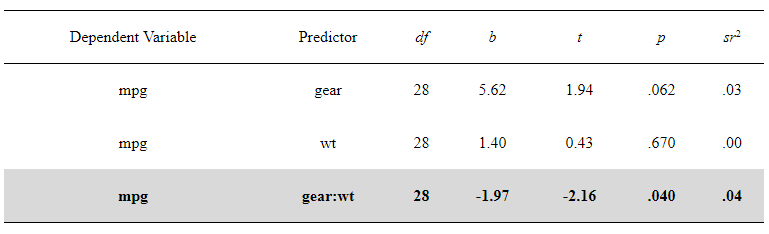

<!-- README.md is generated from README.Rmd. Please edit that file -->

```{r, include = FALSE}
knitr::opts_chunk$set(
  collapse = TRUE,
  comment = "#>",
  fig.path = "man/figures/README-",
  out.width = "100%"
)
```

# rempsyc

<!-- badges: start -->
<!-- badges: end -->

Convenience functions to make your workflow faster and easier. Easily customizable plots (via `ggplot2`), nice APA tables exportable to Word (via `flextable`), easily run statistical tests or check assumptions, and automatize various other tasks.

## Installation

You can install the development version (the only version currently available) of the `rempsyc` package from GitHub with:

``` r
library(devtools)
install_github("rempsyc/rempsyc")
```
You can load the package and open the help file, and click "Index" at the bottom. You will see all the available functions listed.

``` r
library(rempsyc)
?rempsyc
```

## Example functions/outputs

```{r example1, warning = FALSE, message = FALSE}
library(rempsyc)

# Moderations
nice_mod(response = "mpg",
         predictor = "gear",
         moderator = "wt",
         data = mtcars) -> moderations
moderations

# Format results in nice table
my_table <- nice_table(moderations, highlight = TRUE)
my_table
```



```{r example2, warning = FALSE, message = FALSE}
# Save to word
save_as_docx(my_table, path = "D:/R treasures/moderations.docx")

# Violin plot
nice_violin(data = ToothGrowth,
            group = "dose",
            response = "len")

# Scatter plot
nice_scatter(data = mtcars,
             predictor = wt,
             response = mpg)

# Save plot
ggsave('niceplot.pdf', width = 7, height = 7, unit = 'in', 
       dpi = 300, path = "D:/R treasures/")

```

See tutorials here:

https://remi-theriault.com/blog_violin.html

https://remi-theriault.com/blog_scatter.html

https://remi-theriault.com/blog_randomize.html

https://remi-theriault.com/blog_circles.html

https://remi-theriault.com/blog_table.html

https://remi-theriault.com/blog_assumptions

https://remi-theriault.com/blog_t-test

https://remi-theriault.com/blog_moderation

Visit my website here: https://remi-theriault.com

Support me and my work here: https://remi-theriault.com/donate/
