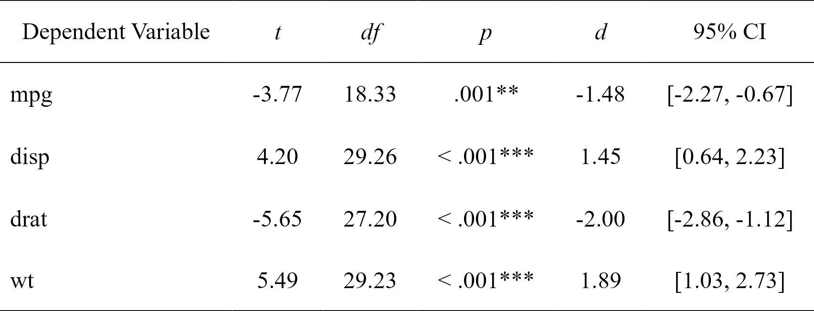
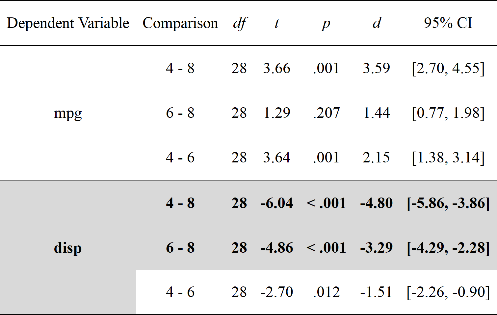
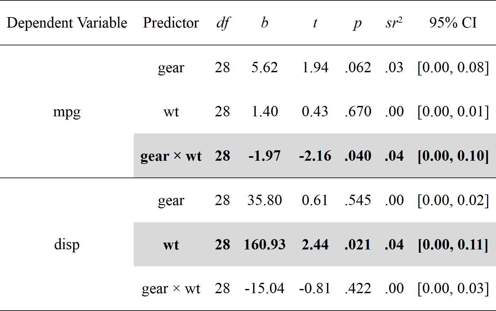
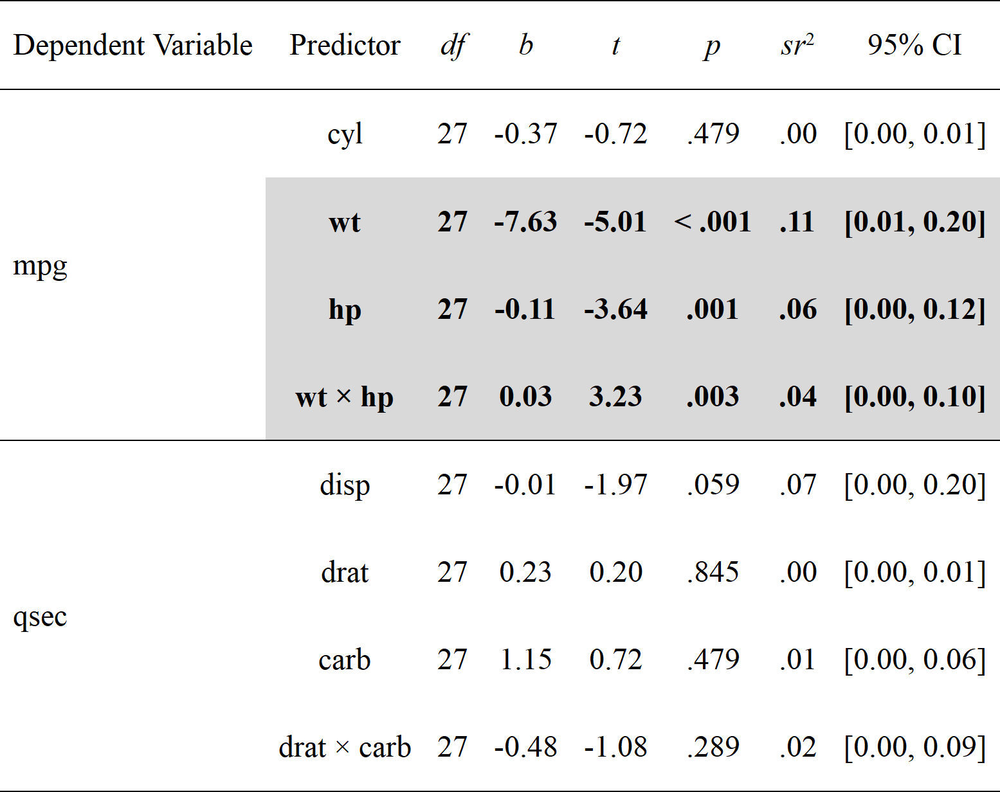
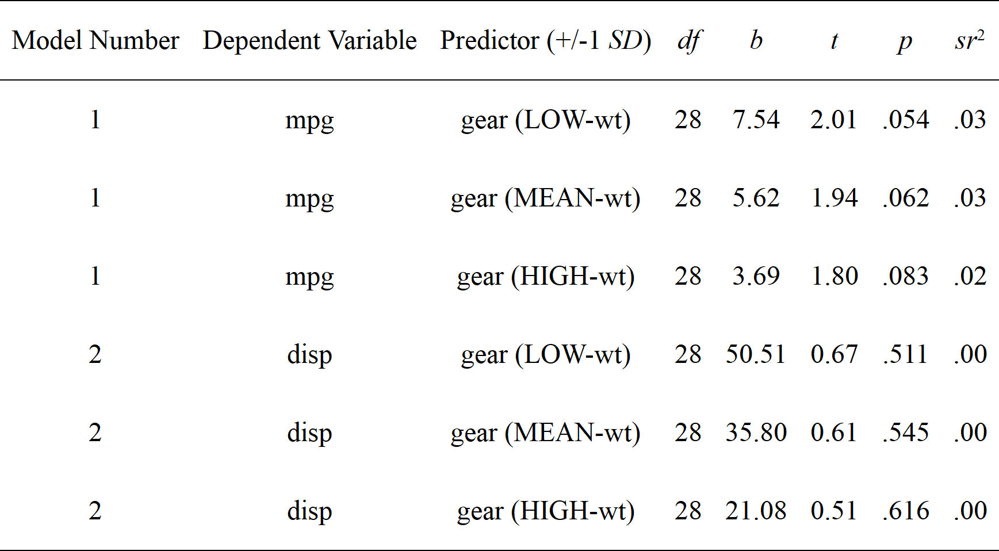

<!-- README.md is generated from README.Rmd. Please edit that file -->

```{r setup, include = FALSE}
knitr::opts_chunk$set(
  collapse = TRUE,
  comment = "#>",
  fig.path = "man/figures/README-",
  out.width = "100%"
)
```

# rempsyc: Convenience functions for psychology 

```{r version, echo = FALSE, message = FALSE, warning = FALSE}
flextable::set_flextable_defaults(background.color = "white")

options(scipen = 999)
library(rempsyc)
```

<!-- badges: start -->
[](https://github.com/rempsyc/rempsyc/actions)
[](https://cran.r-project.org/package=rempsyc)
[](https://rempsyc.r-universe.dev/rempsyc)
[](https://github.com/rempsyc/rempsyc/commits/main)
[](https://lifecycle.r-lib.org/articles/stages.html)
[](https://shinyus.ipub.com/cranview/)
[](https://shinyus.ipub.com/cranview/)
[](https://doi.org/10.21105/joss.05466)
[](https://github.com/sponsors/rempsyc)
[](https://github.com/rempsyc?tab=followers)
[](https://github.com/rempsyc/rempsyc/stargazers)
<!-- badges: end -->

R package of convenience functions to make your workflow faster and easier. Easily customizable plots (via `ggplot2`), nice APA tables exportable to Word (via `flextable`), easily run statistical tests or check assumptions, and automatize various other tasks. Mostly geared at researchers in the psychological sciences. The package is still under active development. Feel free to open an issue to ask for help, report a bug, or request a feature.

- [Release notes](https://rempsyc.remi-theriault.com/news/index.html)
- [Development objectives (to-do list)](https://rempsyc.remi-theriault.com/TODOS.html)

## Installation

You can install the `rempsyc` package directly from CRAN:
``` r
install.packages("rempsyc")
```

Or the development version from the r-universe (note that there is a 24-hour delay with GitHub):
``` r
install.packages("rempsyc", repos = c(
  rempsyc = "https://rempsyc.r-universe.dev",
  CRAN = "https://cloud.r-project.org"))
```

Or from GitHub, for the very latest version:
``` r
# If package `remotes` isn't already installed, install it with `install.packages("remotes")`
remotes::install_github("rempsyc/rempsyc")
```

You can load the package and open the help file, and click "Index" at the bottom. You will see all the available functions listed.
``` r
library(rempsyc)
?rempsyc
```

**Dependencies:** Because `rempsyc` is a package of convenience functions relying on several external packages, it uses (inspired by the [`easystats`](https://easystats.github.io/easystats/) packages) a minimalist philosophy of only installing packages that you need when you need them through `rlang::check_installed()`. Should you wish to specifically install all suggested dependencies at once (you can view the full list by clicking on the CRAN badge on this page), you can run the following (be warned that this may take a long time, as some of the suggested packages are only used in the vignettes or examples):
``` r
install.packages("rempsyc", dependencies = TRUE)
```

## Overview

```{r headers, results = "asis", echo = FALSE}
section.1 <- "Nice APA tables"
section.2 <- "T-tests, planned contrasts, regressions, moderations, simple slopes"
section.3 <- "Visualization"
section.4 <- "Utility functions"
section.5 <- "Testing assumptions"
section.6 <- "lavaanExtra"

cute_cat <- function(x, header.level = 1) {
  cat(rep("#", header.level), " ", x, sep = "")
}

cute_TOC <- function(section) {
  cat("[", section, "]",
    "(#", tolower(gsub(" ", "-", gsub(",", "", section))), ")",
    "<a name = '", section, "'/>",
    "\n \n",
    sep = ""
  )
}

invisible(lapply(
  list(
    section.1, section.2, section.3, section.4, section.5, section.6
  ),
  cute_TOC
))
```

## Nice APA tables

## `nice_table`

Make nice APA tables easily through a wrapper around the `flextable` package with sensical defaults and automatic formatting features.

The tables can be opened in Word with `print(table, preview ="docx")`, or saved to Word with the `flextable::save_as_docx` function, and are `flextable` objects, and can be modified as such. The function also integrates with objects from the `broom` and `report` packages. Full tutorial: https://rempsyc.remi-theriault.com/articles/table

Note: For a smoother and more integrated presentation flow, this function is now featured along the other functions.

## T-tests, planned contrasts, regressions, moderations, simple slopes

## `nice_t_test`

Easily compute t-test analyses, with effect sizes, and format in publication-ready format. Supports multiple dependent variables at once. The 95% confidence interval is for the effect size (Cohen's d).

```{r nice_t_test, warning = FALSE, message = FALSE}
library(rempsyc)

t.tests <- nice_t_test(
  data = mtcars,
  response = c("mpg", "disp", "drat", "wt"),
  group = "am"
)
t.tests
```

```{r nice_table, results='hide'}
# Format t-test results
t_table <- nice_table(t.tests)
t_table
```

```{r save_as_image, include=FALSE}
table_temp <- flextable::autofit(t_table)
flextable::save_as_image(table_temp,
  path = "man/figures/README-nice_t_test-1.png",
  expand = 0, res = 300
)
```



```{r table_save, warning = FALSE, message = FALSE, eval = FALSE}
# Open in Word for quick copy-pasting
print(my_table, preview = "docx")

# Or save to Word
flextable::save_as_docx(t_table, path = "D:/R treasures/t_tests.docx")
```

Full tutorial: https://rempsyc.remi-theriault.com/articles/t-test

## `nice_contrasts `

Easily compute regression with planned contrast analyses (pairwise comparisons similar to t-tests but more powerful when more than 2 groups), and format in publication-ready format. Supports multiple dependent variables at once (but supports only three groups for the moment). In this particular case, the confidence intervals are bootstraped around the Cohen's d.

```{r set.seed, include=FALSE}
set.seed(100)
```

```{r nice_contrasts, warning = FALSE, message = FALSE}
contrasts <- nice_contrasts(
  data = mtcars,
  response = c("mpg", "disp"),
  group = "cyl",
  covariates = "hp"
)
contrasts
```

```{r, results="hide"}
# Format contrasts results
nice_table(contrasts, highlight = .001)
```

```{r, include=FALSE}
table_temp <- contrasts |>
  nice_table(highlight = .001) |>
  flextable::autofit()
flextable::save_as_image(table_temp,
  path = "man/figures/README-nice_contrasts-1.png",
  expand = 0, res = 300
)
```



Full tutorial: https://rempsyc.remi-theriault.com/articles/contrasts

## `nice_mod`

Easily compute moderation analyses, with effect sizes, and format in publication-ready format. Supports multiple dependent variables and covariates at once.

```{r nice_mod, warning = FALSE, message = FALSE}
moderations <- nice_mod(
  data = mtcars,
  response = c("mpg", "disp"),
  predictor = "gear",
  moderator = "wt"
)
moderations
```

```{r, results="hide"}
# Format moderation results
nice_table(moderations, highlight = TRUE)
```

```{r, include=FALSE}
table_temp <- moderations |>
  nice_table(highlight = TRUE) |>
  flextable::autofit()
flextable::save_as_image(table_temp,
  path = "man/figures/README-nice_mod-1.png",
  expand = 0, res = 300
)
```



Full tutorial: https://rempsyc.remi-theriault.com/articles/moderation

## `nice_lm`

For more complicated models not supported by `nice_mod`, one can define the model in the traditional way and feed it to `nice_lm` instead. Supports multiple `lm` models as well.

```{r nice_lm, warning = FALSE, message = FALSE}
model1 <- lm(mpg ~ cyl + wt * hp, mtcars)
model2 <- lm(qsec ~ disp + drat * carb, mtcars)
mods <- nice_lm(list(model1, model2), standardize = TRUE)
mods
```

```{r, results="hide"}
# Format moderation results
nice_table(mods, highlight = TRUE)
```

```{r, include=FALSE}
table_temp <- mods |>
  nice_table(highlight = TRUE) |>
  flextable::autofit()
flextable::save_as_image(table_temp,
  path = "man/figures/README-nice_lm-1.png",
  expand = 0, res = 300
)
```



Full tutorial: https://rempsyc.remi-theriault.com/articles/moderation

## `nice_slopes`

Easily compute simple slopes in moderation analysis, with effect sizes, and format in publication-ready format. Supports multiple dependent variables and covariates at once.

```{r nice_slopes, warning = FALSE, message = FALSE}
simple.slopes <- nice_slopes(
  data = mtcars,
  response = c("mpg", "disp"),
  predictor = "gear",
  moderator = "wt"
)
simple.slopes
```

```{r, results="hide"}
# Format simple slopes results
nice_table(simple.slopes)
```

```{r, include=FALSE}
table_temp <- simple.slopes |>
  nice_table() |>
  flextable::autofit()
flextable::save_as_image(table_temp,
  path = "man/figures/README-nice_slopes-1.png",
  expand = 0, res = 300
)
```



Full tutorial: https://rempsyc.remi-theriault.com/articles/moderation

## `nice_lm_slopes`

For more complicated models not supported by `nice_slopes`, one can define the model in the traditional way and feed it to `nice_lm_slopes` instead. Supports multiple `lm` models as well, but the predictor and moderator need to be the same for these models (the dependent variable can change).

```{r nice_lm_slopes, warning = FALSE, message = FALSE}
model1 <- lm(mpg ~ gear * wt, mtcars)
model2 <- lm(disp ~ gear * wt, mtcars)
my.models <- list(model1, model2)
simple.slopes <- nice_lm_slopes(my.models, predictor = "gear", moderator = "wt", standardize = TRUE)
simple.slopes
```

```{r, results="hide"}
# Format simple slopes results
nice_table(simple.slopes)
```

```{r, include=FALSE}
table_temp <- simple.slopes |>
  nice_table() |>
  flextable::autofit()
flextable::save_as_image(table_temp,
  path = "man/figures/README-nice_lm_slopes-1.png",
  expand = 0, res = 300
)
```


Full tutorial: https://rempsyc.remi-theriault.com/articles/moderation

## Visualization

All plots can be saved with the `ggplot2::ggsave()` function. They are `ggplot2` objects so can be modified as such. 

## `nice_violin`

Make nice violin plots easily with 95% bootstrapped confidence intervals.

```{r nice_violin, warning = FALSE, message = FALSE, fig.width=8, fig.height=7, out.width="60%"}
nice_violin(
  data = ToothGrowth,
  group = "dose",
  response = "len",
  xlabels = c("Low", "Medium", "High"),
  comp1 = 1,
  comp2 = 3,
  has.d = TRUE,
  d.y = 30
)
```

```{r, eval = FALSE}
# Save plot
ggplot2::ggsave("niceplot.pdf",
  width = 7, height = 7, unit = "in",
  dpi = 300, path = "D:/R treasures/"
)
```

Full tutorial: https://rempsyc.remi-theriault.com/articles/violin

## `nice_scatter`

Make nice scatter plots easily.

```{r nice_scatter, warning = FALSE, message = FALSE, fig.width=8, fig.height=7, out.width="60%"}
nice_scatter(
  data = mtcars,
  predictor = "wt",
  response = "mpg",
  has.confband = TRUE,
  has.r = TRUE,
  has.p = TRUE
)
```

```{r nice_scatter2, warning = FALSE, message = FALSE, fig.width=10, fig.height=7, out.width="70%"}
nice_scatter(
  data = mtcars,
  predictor = "wt",
  response = "mpg",
  group = "cyl",
  has.confband = TRUE
)
```

Full tutorial: https://rempsyc.remi-theriault.com/articles/scatter

## `plot_means_over_time`

Make nice plots of means over time, usually for randomized controlled trials with several groups over several time measurements. Error bars represent 95% confidence intervals adjusted for within-subject variance as by the method of Morey (2008).

```{r plot_means_over_time, warning = FALSE, message = FALSE, fig.width=9, fig.height=5, out.width="70%"}
data <- mtcars
names(data)[6:3] <- paste0("T", 1:4, "_some-time-variable")
plot_means_over_time(
  data = data,
  response = names(data)[6:3],
  group = "cyl"
) +
  ggplot2::annotate("text", 
                    x = c(3.8, 3.8, 4.3), 
                    y = c(130, 240, 190), 
                    label = c("*", "*", "***"), 
                    size = 10)
```

## `overlap_circle `

Interpolating the Inclusion of the Other in the Self Scale (self-other merging) easily.

```{r overlap_circle, warning = FALSE, message = FALSE, fig.width=7, fig.height=7, out.width="30%"}
# Score of 3.5 (25% overlap)
overlap_circle(3.5)

# Score of 6.84 (81.8% overlap)
overlap_circle(6.84)
```

Full tutorial: https://rempsyc.remi-theriault.com/articles/circles

## `cormatrix_excel`

Easily output a correlation matrix and export it to Microsoft Excel, with the first row and column frozen, and correlation coefficients colour-coded based on their effect size (0.0-0.2: small (pink/light blue); 0.2-0.4: medium (orange/blue); 0.4-1.0: large (red/dark blue)).

```{r cormatrix_excel2, warning = FALSE}
cormatrix_excel(
  data = infert,
  filename = "cormatrix1",
  select = c(
    "age", "parity", "induced", "case", "spontaneous",
    "stratum", "pooled.stratum"
  )
)
```

```{r cormatrix_excel_remove, include = FALSE}
unlink("cormatrix1.xlsx")
```


## Utility functions

## `nice_na`

Nicely reports NA values according to existing guidelines (i.e, reporting absolute or percentage of item-based missing values, plus each scale's maximum amount of missing values for a given participant). Accordingly, allows specifying a list of columns representing questionnaire items to produce a questionnaire-based report of missing values.

```{r}
# Create synthetic data frame for the demonstration
set.seed(50)
df <- data.frame(
  scale1_Q1 = c(sample(c(NA, 1:6), replace = TRUE), NA, NA),
  scale1_Q2 = c(sample(c(NA, 1:6), replace = TRUE), NA, NA),
  scale1_Q3 = c(sample(c(NA, 1:6), replace = TRUE), NA, NA),
  scale2_Q1 = c(sample(c(NA, 1:6), replace = TRUE), NA, NA),
  scale2_Q2 = c(sample(c(NA, 1:6), replace = TRUE), NA, NA),
  scale2_Q3 = c(sample(c(NA, 1:6), replace = TRUE), NA, NA),
  scale3_Q1 = c(sample(c(NA, 1:6), replace = TRUE), NA, NA),
  scale3_Q2 = c(sample(c(NA, 1:6), replace = TRUE), NA, NA),
  scale3_Q3 = c(sample(c(NA, 1:6), replace = TRUE), NA, NA)
)

# Then select your scales by name
nice_na(df, scales = c("scale1", "scale2", "scale3"))

# Or whole dataframe
nice_na(df)
```

## `extract_duplicates`

Extracts ALL duplicates (including the first one, contrary to `duplicated` or `dplyr::distinct`) to a data frame for visual inspection.

```{r, extract_duplicates}
df1 <- data.frame(
  id = c(1, 2, 3, 1, 3),
  item1 = c(NA, 1, 1, 2, 3),
  item2 = c(NA, 1, 1, 2, 3),
  item3 = c(NA, 1, 1, 2, 3)
)
df1

extract_duplicates(df1, id = "id")
```

## `best_duplicate`

Extracts the "best" duplicate: the one with the fewer number of missing values (in case of ties, picks the first one).

```{r, best_duplicate}
best_duplicate(df1, id = "id")
```

## `scale_mad`

Scale and center ("standardize") data based on the median and median absolute deviation (MAD).

```{r, scale_mad}
scale_mad(mtcars$mpg)
```

## `find_mad`

Identify outliers based on (e.g.,) 3 median absolute deviations (MAD) from the median.

```{r, find_mad}
find_mad(data = mtcars, col.list = names(mtcars)[c(1:7, 10:11)], criteria = 3)
```

## `winsorize_mad`

Winsorize outliers based on (e.g.,) 3 median absolute deviations (MAD).

```{r, winsorize_mad}
winsorize_mad(mtcars$qsec, criteria = 3)
```

## `nice_reverse`

Easily recode scores (reverse-score), typically for questionnaire answers.

```{r nice_reverse, warning = FALSE, message = FALSE}
# Reverse score of 5 with a maximum score of 5
nice_reverse(5, 5)

# Reverse scores with maximum = 4 and minimum = 0
nice_reverse(1:4, 4, min = 0)

# Reverse scores with maximum = 3 and minimum = -3
nice_reverse(-3:3, 3, min = -3)
```

## `format_value`

Easily format *p* or *r* values. Note: converts to `character` class for use in figures or manuscripts to accommodate e.g., "< .001".

```{r format_value, warning = FALSE, message = FALSE}
format_p(0.0041231)
format_p(t.tests$p)
format_r(moderations$sr2)
format_d(t.tests$d)
```

## `nice_randomize`

Randomize easily with different designs.

```{r nice_randomize, warning = FALSE, message = FALSE}
# Specify design, number of conditions, number of participants, and names of conditions:
nice_randomize(
  design = "between", Ncondition = 4, n = 8,
  condition.names = c("BP", "CX", "PZ", "ZL")
)

# Within-Group Design
nice_randomize(
  design = "within", Ncondition = 3, n = 3,
  condition.names = c("SV", "AV", "ST")
)
```

Full tutorial: https://rempsyc.remi-theriault.com/articles/randomize

## Testing assumptions

## `nice_assumptions `

Test linear regression assumptions easily with a nice summary table.

```{r nice_assumptions, eval = FALSE, warning = FALSE, message = FALSE}
# Create regression model
model <- lm(mpg ~ wt * cyl + gear, data = mtcars)
# View results
View(nice_assumptions(model))
```


Full tutorial: https://rempsyc.remi-theriault.com/articles/assumptions

## `nice_normality `

Easily make nice density and QQ plots per-group.

```{r nice_normality, warning = FALSE, message = FALSE, fig.width=16, fig.height=7, out.width="80%"}
nice_normality(
  data = iris,
  variable = "Sepal.Length",
  group = "Species",
  grid = FALSE,
  shapiro = TRUE,
  histogram = TRUE
)
```

Full tutorial: https://rempsyc.remi-theriault.com/articles/assumptions

## `plot_outliers`

Visually check outliers based on (e.g.) +/- 3 MAD (median absolute deviations) or SD (standard deviations).

```{r plot_outliers, warning = FALSE, message = FALSE, fig.width=8, fig.height=7, out.width="70%"}
plot_outliers(airquality,
  group = "Month",
  response = "Ozone"
)

plot_outliers(airquality,
  response = "Ozone",
  method = "sd"
)
```

Full tutorial: https://rempsyc.remi-theriault.com/articles/assumptions

## `nice_var `

Obtain variance per group as well as check for the rule of thumb of one group having variance four times bigger than any of the other groups.

```{r nice_var, warning = FALSE, message = FALSE}
nice_var(
  data = iris,
  variable = "Sepal.Length",
  group = "Species"
)
```

Full tutorial: https://rempsyc.remi-theriault.com/articles/assumptions

## `nice_varplot`

Attempt to visualize variance per group.

```{r nice_varplot, warning = FALSE, message = FALSE, fig.width=8, fig.height=7, out.width="70%"}
nice_varplot(
  data = iris,
  variable = "Sepal.Length",
  group = "Species"
)
```

Full tutorial: https://rempsyc.remi-theriault.com/articles/assumptions

## `lavaanExtra`

For an alternative, vector-based syntax to `lavaan` (a latent variable analysis/structural equation modeling package), as well as other convenience functions such as naming paths and defining indirect links automatically, see my other package, `lavaanExtra`.

https://lavaanExtra.remi-theriault.com/

## Support me and this package

Thank you for your support. You can support me and this package here: https://github.com/sponsors/rempsyc
