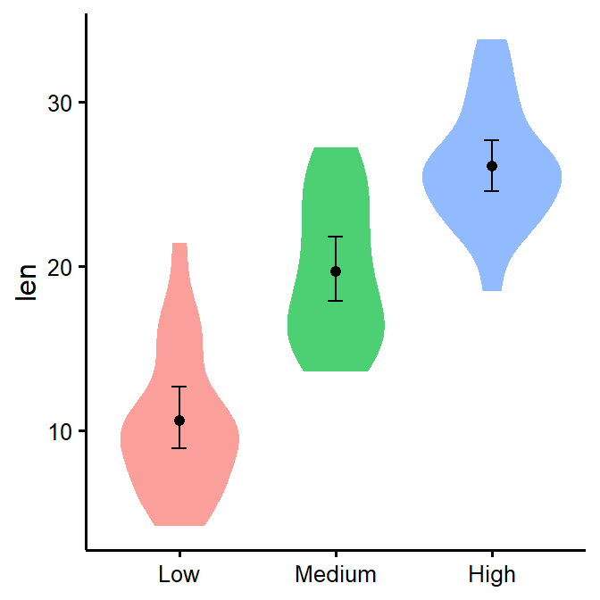
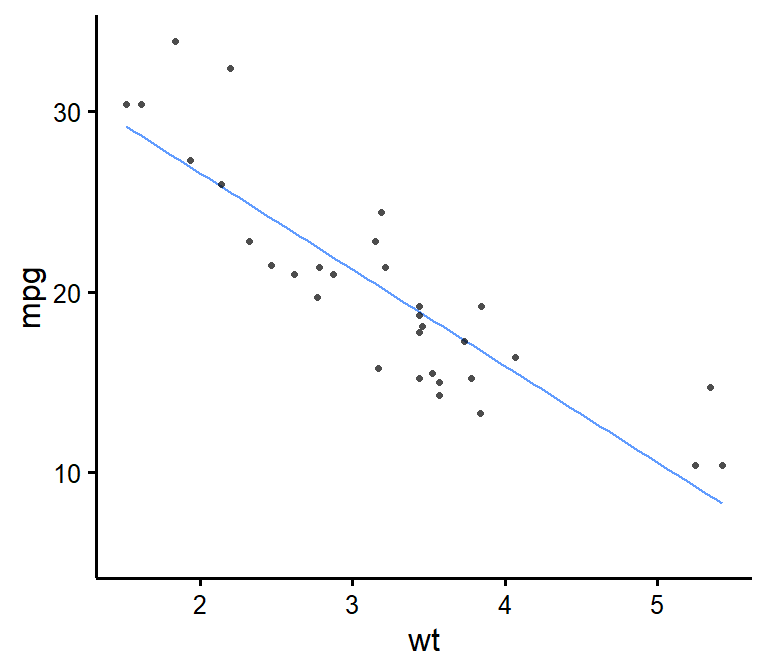

<!-- README.md is generated from README.Rmd. Please edit that file -->

# rempsyc 

<!-- badges: start -->

[](https://github.com/RemPsyc/rempsyc/actions)
[](https://www.repostatus.org/#active)
[](https://github.com/RemPsyc/rempsyc/commits/main)
[](https://github.com/RemPsyc/rempsyc/commits/main)
[](https://github.com/RemPsyc/rempsyc/commits/main)
[](https://www.gnu.org/licenses/gpl-3.0.en.html)

[](https://paypal.me/rempsyc)
[](https://github.com/RemPsyc?tab=followers)
[](https://github.com/RemPsyc/rempsyc/network/members)

<!-- badges: end -->

Convenience functions to make your workflow faster and easier. Easily
customizable plots (via `ggplot2`), nice APA tables exportable to Word
(via `flextable`), easily run statistical tests or check assumptions,
and automatize various other tasks. Mostly geared at researchers in the
psychological sciences.

## Installation

You can install the development version (the only version currently
available) of the `rempsyc` package from GitHub with:

``` r
# If devtools isn't already installed, install it with install.packages("devtools")
library(devtools)
install_github("rempsyc/rempsyc")
```

You can load the package and open the help file, and click “Index” at
the bottom. You will see all the available functions listed.

``` r
library(rempsyc)
?rempsyc
```

## Example functions/outputs

``` r
library(rempsyc)

# Moderations
nice_mod(response = "mpg",
         predictor = "gear",
         moderator = "wt",
         data = mtcars) -> moderations
moderations
#>   Dependent Variable Predictor df         b          t          p         sr2
#> 1                mpg      gear 28  5.615951  1.9437108 0.06204275 0.028488305
#> 2                mpg        wt 28  1.403861  0.4301493 0.67037970 0.001395217
#> 3                mpg   gear:wt 28 -1.966931 -2.1551077 0.03989970 0.035022025

# Format results in nice table
my_table <- nice_table(moderations, highlight = TRUE)
my_table
```


``` r
# Save to word
save_as_docx(my_table, path = "D:/R treasures/moderations.docx")

# Violin plot
nice_violin(data = ToothGrowth,
            group = "dose",
            response = "len",
            xlabels = c("Low", "Medium", "High"))
```



``` r
# Scatter plot
nice_scatter(data = mtcars,
             predictor = wt,
             response = mpg)
```



``` r
# Save plot
ggsave('niceplot.pdf', width = 7, height = 7, unit = 'in', 
       dpi = 300, path = "D:/R treasures/")
```

See tutorials here:

<https://remi-theriault.com/blog_violin.html>

<https://remi-theriault.com/blog_scatter.html>

<https://remi-theriault.com/blog_randomize.html>

<https://remi-theriault.com/blog_circles.html>

<https://remi-theriault.com/blog_table.html>

<https://remi-theriault.com/blog_assumptions>

<https://remi-theriault.com/blog_t-test>

<https://remi-theriault.com/blog_moderation>

Visit my website here: <https://remi-theriault.com>

Support me and my work here: <https://remi-theriault.com/donate/>
