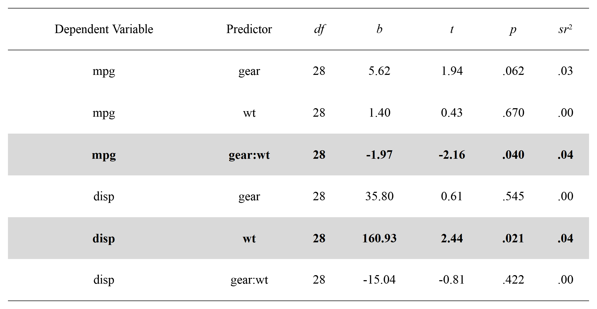
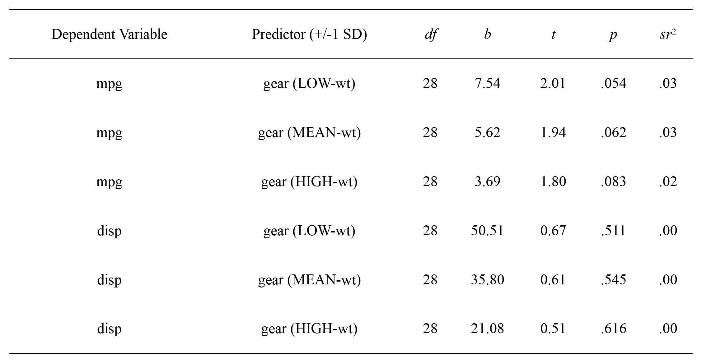
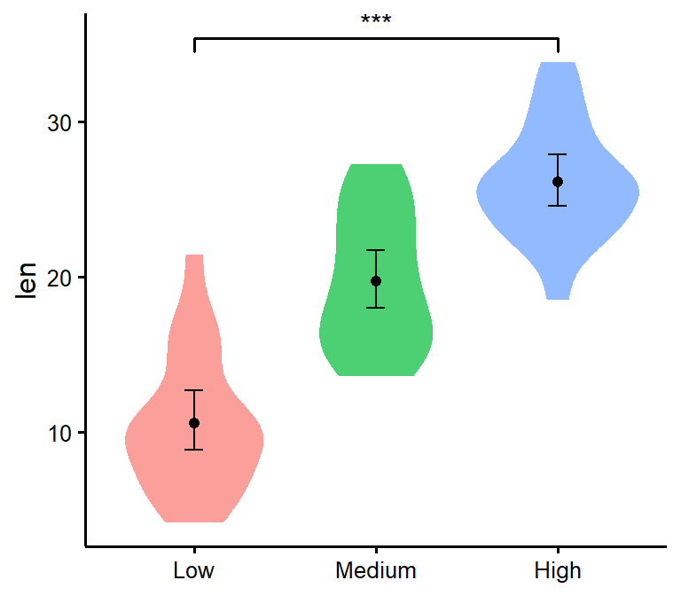
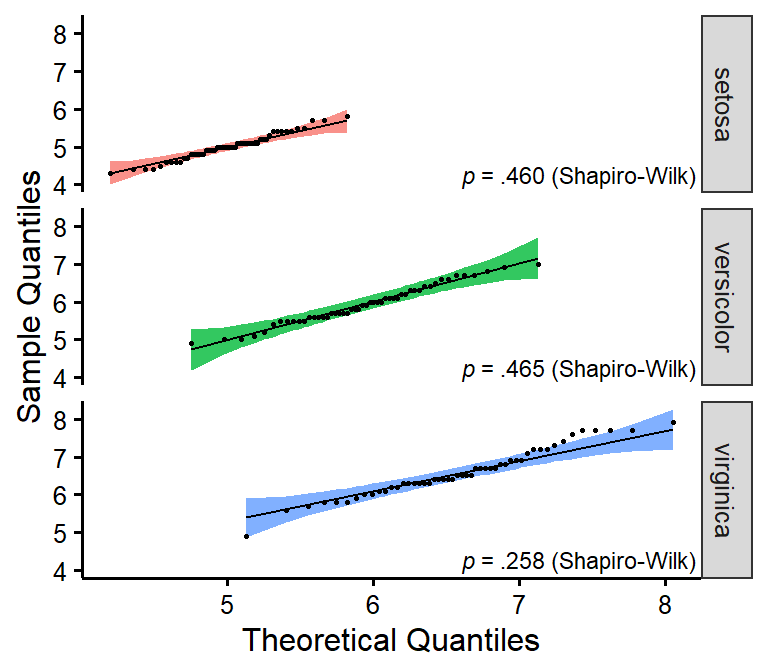
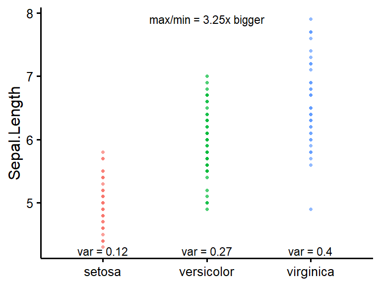

<!-- README.md is generated from README.Rmd. Please edit that file -->

# rempsyc 

<!-- badges: start -->

[](https://github.com/RemPsyc/rempsyc/actions)
[](https://www.repostatus.org/#active)
[](https://github.com/RemPsyc/rempsyc/commits/main)
[](https://github.com/RemPsyc/rempsyc/commits/main)
[](https://www.gnu.org/licenses/gpl-3.0.en.html)

[](https://paypal.me/rempsyc)
[](https://github.com/RemPsyc?tab=followers)
[](https://github.com/RemPsyc/rempsyc/network/members)

<!-- badges: end -->

Convenience functions to make your workflow faster and easier. Easily
customizable plots (via `ggplot2`), nice APA tables exportable to Word
(via `flextable`), easily run statistical tests or check assumptions,
and automatize various other tasks. Mostly geared at researchers in the
psychological sciences.

## Installation

You can install the development version (the only version currently
available) of the `rempsyc` package from GitHub with:

``` r
# If devtools isn't already installed, install it with install.packages("devtools")
devtools::install_github("rempsyc/rempsyc")
```

You can load the package and open the help file, and click “Index” at
the bottom. You will see all the available functions listed.

``` r
library(rempsyc)
?rempsyc
```

## Features

All plots can be saved with the `ggsave()` function. They are `ggplot`
objects so can be modified as such. The tables can be saved with the
`save_as_docx` function, and are `flextable` objects, and can be
modified as such.

### `nice_reverse`

Easily recode scores (reverse-score), typically for questionnaire
answers.

``` r
library(rempsyc)

# Reverse score of 5 with a maximum score of 5
nice_reverse(5, 5)
#> [1] 1

# Reverse scores with maximum = 4 and minimum = 0
nice_reverse(1:4, 4, min = 0)
#> [1] 3 2 1 0

# Reverse scores with maximum = 3 and minimum = -3
nice_reverse(-3:3, 3, min = -3)
#> [1]  3  2  1  0 -1 -2 -3
```

### `nice_t_test`

Easily compute t-test analyses, with effect sizes, and format in
publication-ready format. Supports multiple dependent variables at once.

``` r
nice_t_test(response = c("mpg", "disp", "drat", "wt"),
            group = "am",
            data = mtcars) -> t.tests
t.tests
#>   Dependent Variable         t       df            p         d   CI_lower
#> 1                mpg -3.767123 18.33225 1.373638e-03 -1.477947 -2.3042092
#> 2               disp  4.197727 29.25845 2.300413e-04  1.445221  0.6227403
#> 3               drat -5.646088 27.19780 5.266742e-06 -2.003084 -2.8985400
#> 4                 wt  5.493905 29.23352 6.272020e-06  1.892406  1.0127792
#>    CI_upper
#> 1 -0.651685
#> 2  2.267702
#> 3 -1.107629
#> 4  2.772033
```

Full tutorial: <https://remi-theriault.com/blog_t-test>

### `nice_mod`

Easily compute moderation analyses, with effect sizes, and format in
publication-ready format. Supports multiple dependent variables and
covariates at once.

``` r
nice_mod(response = c("mpg", "disp"),
         predictor = "gear",
         moderator = "wt",
         data = mtcars) -> moderations
moderations
#>   Dependent Variable Predictor df          b          t          p         sr2
#> 1                mpg      gear 28   5.615951  1.9437108 0.06204275 0.028488305
#> 2                mpg        wt 28   1.403861  0.4301493 0.67037970 0.001395217
#> 3                mpg   gear:wt 28  -1.966931 -2.1551077 0.03989970 0.035022025
#> 4               disp      gear 28  35.797623  0.6121820 0.54535707 0.002737218
#> 5               disp        wt 28 160.930043  2.4364098 0.02144867 0.043355972
#> 6               disp   gear:wt 28 -15.037022 -0.8140664 0.42247646 0.004840251
```

Full tutorial: <https://remi-theriault.com/blog_moderation>

### `nice_slopes`

Easily compute simple slopes in moderation analysis, with effect sizes,
and format in publication-ready format. Supports multiple dependent
variables and covariates at once.

``` r
nice_slopes(response = c("mpg", "disp"),
            predictor = "gear",
            moderator = "wt",
            data = mtcars) -> simple.slopes
simple.slopes
#>   Dependent Variable Predictor (+/-1 SD) df         b         t          p
#> 1                mpg       gear (LOW-wt) 28  7.540509 2.0106560 0.05408136
#> 3                mpg      gear (MEAN-wt) 28  5.615951 1.9437108 0.06204275
#> 5                mpg      gear (HIGH-wt) 28  3.691393 1.7955678 0.08336403
#> 2               disp       gear (LOW-wt) 28 50.510710 0.6654856 0.51118526
#> 4               disp      gear (MEAN-wt) 28 35.797623 0.6121820 0.54535707
#> 6               disp      gear (HIGH-wt) 28 21.084536 0.5067498 0.61629796
#>           sr2
#> 1 0.030484485
#> 3 0.028488305
#> 5 0.024311231
#> 2 0.003234637
#> 4 0.002737218
#> 6 0.001875579
```

Full tutorial: <https://remi-theriault.com/blog_moderation>

### `nice_table`

Make nice APA tables easily through a wrapper around the `flextable`
package with sensical defaults and automatic formatting features.

``` r
# Format t-test results
t_table <- nice_table(t.tests, width = .75)
t_table
```


``` r
# Save to word
save_as_docx(t_table, path = "D:/R treasures/t_tests.docx")
```

``` r
# Format moderation results
mod_table <- nice_table(moderations, highlight = TRUE, width = .75)
mod_table
```



``` r
# Format simple slopes results
slopes_table <- nice_table(simple.slopes, width = .75)
slopes_table
```



Full tutorial: <https://remi-theriault.com/blog_table.html>

### `nice_violin`

Make nice violin plots easily with 95% bootstrapped confidence
intervals.

``` r
nice_violin(data = ToothGrowth,
            group = "dose",
            response = "len",
            xlabels = c("Low", "Medium", "High"),
            comp1 = 1,
            comp2 = 3)
```



``` r
# Save plot
ggsave('niceplot.pdf', width = 7, height = 7, unit = 'in', 
       dpi = 300, path = "D:/R treasures/")
```

Full tutorial: <https://remi-theriault.com/blog_violin.html>

### `nice_scatter`

Make nice scatter plots easily.

``` r
nice_scatter(data = mtcars,
             predictor = wt,
             response = mpg,
             has.confband = TRUE,
             has.r = TRUE,
             has.p = TRUE)
```


Full tutorial: <https://remi-theriault.com/blog_scatter.html>

### `nice_randomize`

Randomize easily with different designs.

``` r
# Specify design, number of conditions, number of participants, and names of conditions:
nice_randomize(design = "between", Ncondition = 4, n = 8,
               condition.names = c("BP","CX","PZ","ZL"))
#>   id Condition
#> 1  1        CX
#> 2  2        BP
#> 3  3        ZL
#> 4  4        PZ
#> 5  5        PZ
#> 6  6        CX
#> 7  7        BP
#> 8  8        ZL

# Within-Group Design
nice_randomize(design = "within", Ncondition = 3, n = 3,
               condition.names = c("SV","AV","ST"))
#>   id Condition
#> 1  1        ST
#> 2  2        ST
#> 3  3        SV
#> 4  1        SV
#> 5  2        SV
#> 6  3        AV
#> 7  1        AV
#> 8  2        AV
#> 9  3        ST
```

Full tutorial: <https://remi-theriault.com/blog_randomize.html>

### `overlap_circle`

Interpolating the Inclusion of the Other in the Self Scale (self-other
merging) easily.

``` r
# Score of 3.5 (25% overlap)
overlap_circle(3.5)
```


``` r
# Score of 6.84 (81.8% overlap)
overlap_circle(6.84)
```


Full tutorial: <https://remi-theriault.com/blog_circles.html>

## Testing assumptions

Full tutorial: <https://remi-theriault.com/blog_assumptions>

### `nice_assumptions`

Test linear regression assumptions easily with a nice summary table.

``` r
# Create regression model
model <- lm(mpg ~ wt * cyl + gear, data = mtcars)
# View results
View(nice_assumptions(model))
#> Interpretation: (p) values < .05 imply assumptions are not respected. 
#> Diagnostic is how many assumptions are not respected for a given model or variable. 
#> 
```


### `nice_qq`

Easily make nice per-group QQ plots.

``` r
# Create regression model
nice_qq(variable = "Sepal.Length",
       group = "Species",
       data = iris,
       grid = FALSE,
       shapiro = TRUE,
       title = NULL)
```



### `nice_density`

Easily make nice per-group QQ plots.

``` r
# Create regression model
nice_density(variable = "Sepal.Length",
            group = "Species",
            data = iris,
            xtitle = "Sepal Length",
            ytitle = "Density (vs. Normal Distribution)",
            grid = FALSE,
            shapiro = TRUE,
            title = "Density (Sepal Length)")
```


### `nice_var`

Obtain variance per group as well as check for the rule of thumb of one
group having variance four times bigger than any of the other groups.

``` r
nice_var(variable="Sepal.Length",
         group="Species",
         data=iris)
#> # A tibble: 1 x 6
#> # Rowwise: 
#>   Variable     Setosa Versicolor Virginica `Max/Min Ratio` `Heteroscedastic (F~`
#>   <chr>         <dbl>      <dbl>     <dbl>           <dbl> <lgl>                
#> 1 Sepal.Length  0.124      0.266     0.404             3.3 FALSE
```

### `nice_varplot`

Attempt to visualize variance per group. It is not a good way to
visualize variance because the concentration of points may be hidden on
such plots. Use at your own risk and for exploratory purposes only.

``` r
nice_varplot(variable = "Sepal.Length",
             group = "Species",
             data = iris)
```



## Support me and this package

Thank you for your support. You can support me and this package here:
<https://remi-theriault.com/donate/>
