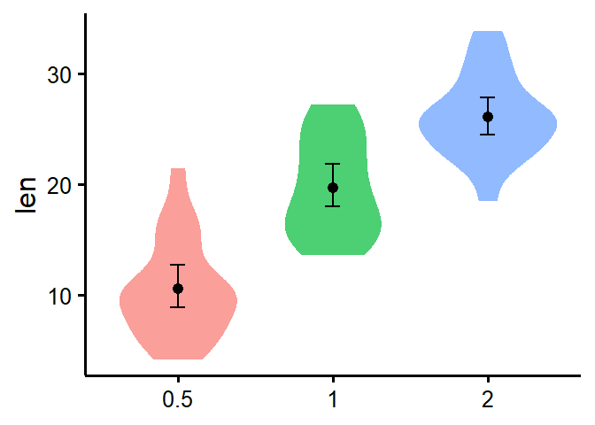
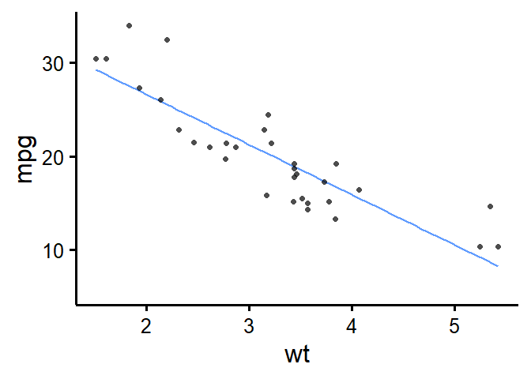

<!-- README.md is generated from README.Rmd. Please edit that file -->

# rempsyc

<!-- badges: start -->
<!-- badges: end -->

Convenience functions to make your workflow faster and easier. Easily
customizable plots (via ‘ggplot2’), nice APA tables exportable to Word
(via ‘flextable’), easily ran statistical tests or check assumptions,
and automatization of various other tasks.

## Installation

You can install the released version of rempsyc from GitHub with:

``` r
library(devtools)
install_github("rempsyc/rempsyc")
```

You can load library and open the help file, and click “Index” at the
bottom. You will see all the functions listed.

``` r
library(rempsyc)
?rempsyc
```

## Example functions/outputs

``` r
library(rempsyc)

# Moderations
nice_mod(response = "mpg",
         predictor = "gear",
         moderator = "wt",
         data = mtcars) -> moderations
moderations
#>   Dependent Variable Predictor df         b          t          p         sr2
#> 1                mpg      gear 28  5.615951  1.9437108 0.06204275 0.028488305
#> 2                mpg        wt 28  1.403861  0.4301493 0.67037970 0.001395217
#> 3                mpg   gear:wt 28 -1.966931 -2.1551077 0.03989970 0.035022025

# Format results in nice table
(my_table <- nice_table(moderations, highlight = TRUE))
#> 
#> Attaching package: 'dplyr'
#> The following objects are masked from 'package:stats':
#> 
#>     filter, lag
#> The following objects are masked from 'package:base':
#> 
#>     intersect, setdiff, setequal, union
```

``` r
# Save to word
save_as_docx(my_table, path = "D:/R treasures/moderations.docx")

# Violin plot
nice_violin(data = ToothGrowth,
            group = "dose",
            response = "len")
#> Registered S3 method overwritten by 'DescTools':
#>   method         from  
#>   reorder.factor gplots
```



``` r
# Scatter plot
nice_scatter(data = mtcars,
             predictor = wt,
             response = mpg)
#> `geom_smooth()` using formula 'y ~ x'
```



See tutorials here:

<https://remi-theriault.com/blog_violin.html>

<https://remi-theriault.com/blog_scatter.html>

<https://remi-theriault.com/blog_randomize.html>

<https://remi-theriault.com/blog_circles.html>

<https://remi-theriault.com/blog_table.html>

<https://remi-theriault.com/blog_assumptions>

<https://remi-theriault.com/blog_t-test>

<https://remi-theriault.com/blog_moderation>
