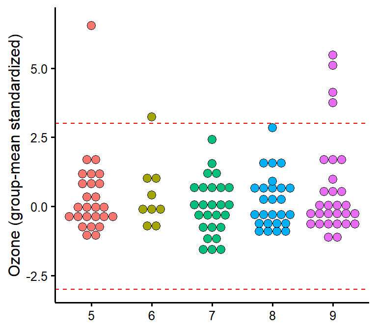
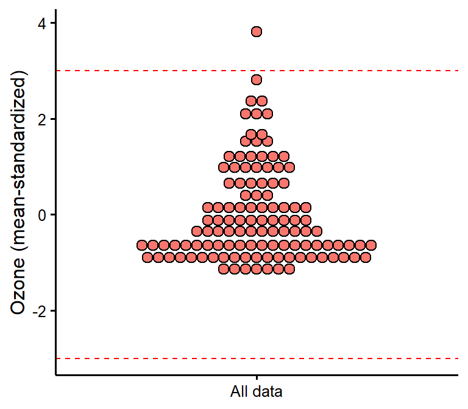

<!-- README.md is generated from README.Rmd. Please edit that file -->

# rempsyc: Convenience functions for psychology 

<!-- badges: start -->

[](https://github.com/rempsyc/rempsyc/actions)
[](https://rempsyc.r-universe.dev/ui#package:rempsyc)
[](https://cran.r-project.org/package=rempsyc)
[](https://github.com/rempsyc/rempsyc/commits/main)
[](https://www.gnu.org/licenses/gpl-3.0.en.html)
[](https://shinyus.ipub.com/cranview/)
[](https://shinyus.ipub.com/cranview/)
[](https://github.com/sponsors/rempsyc)
[](https://github.com/rempsyc?tab=followers)
[](https://github.com/rempsyc/rempsyc/network/members)
[](https://github.com/rempsyc/rempsyc/stargazers)
<!-- badges: end -->

R package of convenience functions to make your workflow faster and
easier. Easily customizable plots (via `ggplot2`), nice APA tables
exportable to Word (via `flextable`), easily run statistical tests or
check assumptions, and automatize various other tasks. Mostly geared at
researchers in the psychological sciences. The package is still under
active development. Feel free to open an issue to ask for help, report a
bug, or request a feature.

- [Release notes](https://rempsyc.remi-theriault.com/news/index.html)
- [Development objectives (to-do
  list)](https://rempsyc.remi-theriault.com/TODOS.html)

## Installation

You can install the `rempsyc` package directly from CRAN:

``` r
install.packages("rempsyc")
```

Or the development version from the r-universe (note that there is a
24-hour delay with GitHub):

``` r
install.packages("rempsyc", repos = c(
  rempsyc = "https://rempsyc.r-universe.dev",
  CRAN = "https://cloud.r-project.org"))
```

Or from GitHub, for the very latest version:

``` r
# If package `remotes` isn't already installed, install it with `install.packages("remotes")`
remotes::install_github("rempsyc/rempsyc")
```

You can load the package and open the help file, and click “Index” at
the bottom. You will see all the available functions listed.

``` r
library(rempsyc)
?rempsyc
```

## Overview

[Nice APA tables](#nice-apa-tables)<a name = 'Nice APA tables'/>

[T-tests, planned contrasts, regressions, moderations, simple
slopes](#t-tests-planned-contrasts-regressions-moderations-simple-slopes)<a name = 'T-tests, planned contrasts, regressions, moderations, simple slopes'/>

[Visualization](#visualization)<a name = 'Visualization'/>

[Utility functions](#utility-functions)<a name = 'Utility functions'/>

[Testing
assumptions](#testing-assumptions)<a name = 'Testing assumptions'/>

[lavaanExtra](#lavaanextra)<a name = 'lavaanExtra'/>

## Nice APA tables

## `nice_table`

Make nice APA tables easily through a wrapper around the `flextable`
package with sensical defaults and automatic formatting features.

The tables can be saved with the `flextable::save_as_docx` function, and
are `flextable` objects, and can be modified as such. The function also
integrates with objects from the `broom` and `report` packages. Full
tutorial: <https://rempsyc.remi-theriault.com/articles/table>

Note: For a smoother and more integrated presentation flow, this
function is now featured along the other functions.

## T-tests, planned contrasts, regressions, moderations, simple slopes

## `nice_t_test`

Easily compute t-test analyses, with effect sizes, and format in
publication-ready format. Supports multiple dependent variables at once.
The 95% confidence interval is for the effect size (Cohen’s d).

``` r
library(rempsyc)

nice_t_test(data = mtcars,
            response = c("mpg", "disp", "drat", "wt"),
            group = "am") -> t.tests
t.tests
#>   Dependent Variable         t       df            p         d   CI_lower
#> 1                mpg -3.767123 18.33225 1.373638e-03 -1.477947 -2.2659731
#> 2               disp  4.197727 29.25845 2.300413e-04  1.445221  0.6417834
#> 3               drat -5.646088 27.19780 5.266742e-06 -2.003084 -2.8592770
#> 4                 wt  5.493905 29.23352 6.272020e-06  1.892406  1.0300224
#>     CI_upper
#> 1 -0.6705686
#> 2  2.2295592
#> 3 -1.1245498
#> 4  2.7329218

# Format t-test results
t_table <- nice_table(t.tests)
t_table
```


``` r
# Save to word
flextable::save_as_docx(t_table, path = "D:/R treasures/t_tests.docx")
```

Full tutorial: <https://rempsyc.remi-theriault.com/articles/t-test>

## `nice_contrasts`

Easily compute regression with planned contrast analyses (pairwise
comparisons similar to t-tests but more powerful when more than 2
groups), and format in publication-ready format. Supports multiple
dependent variables at once (but supports only three groups for the
moment). In this particular case, the confidence intervals are
bootstraped around the Cohen’s d.

``` r
nice_contrasts(data = mtcars,
               response = c("mpg", "disp"),
               group = "cyl",
               covariates = "hp") -> contrasts
contrasts
#>   Dependent Variable Comparison df         t            p        dR   CI_lower
#> 1                mpg      4 - 8 28  3.663188 1.028617e-03  3.031774  2.1356887
#> 2                mpg      6 - 8 28  1.290359 2.074806e-01  1.245144  0.6765467
#> 3                mpg      4 - 6 28  3.640418 1.092089e-03  1.786630  1.0741272
#> 4               disp      4 - 8 28 -6.040561 1.640986e-06 -3.467937 -5.0399942
#> 5               disp      6 - 8 28 -4.861413 4.051110e-05 -2.427185 -3.8659404
#> 6               disp      4 - 6 28 -2.703423 1.153440e-02 -1.040753 -1.8108553
#>     CI_upper
#> 1  5.6812538
#> 2  2.3297249
#> 3  4.1769305
#> 4 -2.4329681
#> 5 -1.5472735
#> 6 -0.4639611

# Format contrasts results
nice_table(contrasts, highlight = .001)
```


Full tutorial: <https://rempsyc.remi-theriault.com/articles/contrasts>

## `nice_mod`

Easily compute moderation analyses, with effect sizes, and format in
publication-ready format. Supports multiple dependent variables and
covariates at once.

``` r
moderations <- nice_mod(
  data = mtcars,
  response = c("mpg", "disp"),
  predictor = "gear",
  moderator = "wt")
moderations
#>   Model Number Dependent Variable Predictor df          b          t          p
#> 1            1                mpg      gear 28   5.615951  1.9437108 0.06204275
#> 2            1                mpg        wt 28   1.403861  0.4301493 0.67037970
#> 3            1                mpg   gear:wt 28  -1.966931 -2.1551077 0.03989970
#> 4            2               disp      gear 28  35.797623  0.6121820 0.54535707
#> 5            2               disp        wt 28 160.930043  2.4364098 0.02144867
#> 6            2               disp   gear:wt 28 -15.037022 -0.8140664 0.42247646
#>           sr2     CI_lower   CI_upper
#> 1 0.028488305 0.0000000000 0.08418650
#> 2 0.001395217 0.0000000000 0.01331121
#> 3 0.035022025 0.0003502202 0.09723370
#> 4 0.002737218 0.0000000000 0.01919662
#> 5 0.043355972 0.0004335597 0.11228977
#> 6 0.004840251 0.0000000000 0.02679265

# Format moderation results
nice_table(moderations, highlight = TRUE)
```


Full tutorial: <https://rempsyc.remi-theriault.com/articles/moderation>

## `nice_lm`

For more complicated models not supported by `nice_mod`, one can define
the model in the traditional way and feed it to `nice_lm` instead.
Supports multiple `lm` models as well.

``` r

model1 <- lm(mpg ~ cyl + wt * hp, mtcars)
model2 <- lm(qsec ~ disp + drat * carb, mtcars)
mods <- nice_lm(list(model1, model2))
mods
#>   Model Number Dependent Variable Predictor df            b          t
#> 1            1                mpg       cyl 27 -0.365239089 -0.7180977
#> 2            1                mpg        wt 27 -7.627489287 -5.0146028
#> 3            1                mpg        hp 27 -0.108394273 -3.6404181
#> 4            1                mpg     wt:hp 27  0.025836594  3.2329593
#> 5            2               qsec      disp 27 -0.006222635 -1.9746464
#> 6            2               qsec      drat 27  0.227692395  0.1968842
#> 7            2               qsec      carb 27  1.154106215  0.7179431
#> 8            2               qsec drat:carb 27 -0.477539959 -1.0825727
#>              p          sr2     CI_lower   CI_upper
#> 1 4.788652e-01 0.0021596150 0.0000000000 0.01306786
#> 2 2.928375e-05 0.1053130854 0.0089876445 0.20163853
#> 3 1.136403e-03 0.0555024045 0.0005550240 0.11934768
#> 4 3.221753e-03 0.0437733438 0.0004377334 0.09898662
#> 5 5.861684e-02 0.0702566891 0.0000000000 0.19796621
#> 6 8.453927e-01 0.0006984424 0.0000000000 0.01347203
#> 7 4.789590e-01 0.0092872897 0.0000000000 0.05587351
#> 8 2.885720e-01 0.0211165564 0.0000000000 0.09136014

# Format moderation results
nice_table(mods, highlight = TRUE)
```


Full tutorial: <https://rempsyc.remi-theriault.com/articles/moderation>

## `nice_slopes`

Easily compute simple slopes in moderation analysis, with effect sizes,
and format in publication-ready format. Supports multiple dependent
variables and covariates at once.

``` r
simple.slopes <- nice_slopes(
  data = mtcars,
  response = c("mpg", "disp"),
  predictor = "gear",
  moderator = "wt")
simple.slopes
#>   Model Number Dependent Variable Predictor (+/-1 SD) df         b         t
#> 1            1                mpg       gear (LOW-wt) 28  7.540509 2.0106560
#> 2            1                mpg      gear (MEAN-wt) 28  5.615951 1.9437108
#> 3            1                mpg      gear (HIGH-wt) 28  3.691393 1.7955678
#> 4            2               disp       gear (LOW-wt) 28 50.510710 0.6654856
#> 5            2               disp      gear (MEAN-wt) 28 35.797623 0.6121820
#> 6            2               disp      gear (HIGH-wt) 28 21.084536 0.5067498
#>            p         sr2 CI_lower   CI_upper
#> 1 0.05408136 0.030484485        0 0.08823243
#> 2 0.06204275 0.028488305        0 0.08418650
#> 3 0.08336403 0.024311231        0 0.07551496
#> 4 0.51118526 0.003234637        0 0.02113980
#> 5 0.54535707 0.002737218        0 0.01919662
#> 6 0.61629796 0.001875579        0 0.01548357

# Format simple slopes results
nice_table(simple.slopes)
```


Full tutorial: <https://rempsyc.remi-theriault.com/articles/moderation>

## `nice_lm_slopes`

For more complicated models not supported by `nice_slopes`, one can
define the model in the traditional way and feed it to `nice_lm_slopes`
instead. Supports multiple `lm` models as well, but the predictor and
moderator need to be the same for these models (the dependent variable
can change).

``` r
model1 <- lm(mpg ~ gear * wt, mtcars)
model2 <- lm(disp ~ gear * wt, mtcars)
my.models <- list(model1, model2)
simple.slopes <- nice_lm_slopes(my.models, predictor = "gear", moderator = "wt")
simple.slopes
#>   Model Number Dependent Variable Predictor (+/-1 SD) df         b         t
#> 1            1                mpg       gear (LOW-wt) 28  7.540509 2.0106560
#> 2            1                mpg      gear (MEAN-wt) 28  5.615951 1.9437108
#> 3            1                mpg      gear (HIGH-wt) 28  3.691393 1.7955678
#> 4            2               disp       gear (LOW-wt) 28 50.510710 0.6654856
#> 5            2               disp      gear (MEAN-wt) 28 35.797623 0.6121820
#> 6            2               disp      gear (HIGH-wt) 28 21.084536 0.5067498
#>            p         sr2 CI_lower   CI_upper
#> 1 0.05408136 0.030484485        0 0.08823243
#> 2 0.06204275 0.028488305        0 0.08418650
#> 3 0.08336403 0.024311231        0 0.07551496
#> 4 0.51118526 0.003234637        0 0.02113980
#> 5 0.54535707 0.002737218        0 0.01919662
#> 6 0.61629796 0.001875579        0 0.01548357

# Format simple slopes results
nice_table(simple.slopes)
```


Full tutorial: <https://rempsyc.remi-theriault.com/articles/moderation>

## Visualization

All plots can be saved with the `ggplot2::ggsave()` function. They are
`ggplot2` objects so can be modified as such.

## `nice_violin`

Make nice violin plots easily with 95% bootstrapped confidence
intervals.

``` r
nice_violin(data = ToothGrowth,
            group = "dose",
            response = "len",
            xlabels = c("Low", "Medium", "High"),
            comp1 = 1,
            comp2 = 3,
            has.d = TRUE,
            d.y = 30)
```


``` r
# Save plot
ggplot2::ggsave('niceplot.pdf', width = 7, height = 7, unit = 'in', 
                dpi = 300, path = "D:/R treasures/")
```

Full tutorial: <https://rempsyc.remi-theriault.com/articles/violin>

## `nice_scatter`

Make nice scatter plots easily.

``` r
nice_scatter(data = mtcars,
             predictor = "wt",
             response = "mpg",
             has.confband = TRUE,
             has.r = TRUE,
             has.p = TRUE)
```


``` r

nice_scatter(data = mtcars,
             predictor = "wt",
             response = "mpg",
             group = "cyl",
             has.confband = TRUE)
```


Full tutorial: <https://rempsyc.remi-theriault.com/articles/scatter>

## `overlap_circle`

Interpolating the Inclusion of the Other in the Self Scale (self-other
merging) easily.

``` r

# Score of 3.5 (25% overlap)
overlap_circle(3.5)
```


``` r

# Score of 6.84 (81.8% overlap)
overlap_circle(6.84)
```


Full tutorial: <https://rempsyc.remi-theriault.com/articles/circles>

## `cormatrix_excel`

Easily output a correlation matrix and export it to Microsoft Excel,
with the first row and column frozen, and correlation coefficients
colour-coded based on their effect size (0.0-0.2: small (pink/light
blue); 0.2-0.4: medium (orange/blue); 0.4-1.0: large (red/dark blue)).

``` r

cormatrix_excel(infert, "cormatrix1")
#> # Correlation Matrix (pearson-method)
#> 
#> Parameter      |      age |   parity |  induced |     case | spontaneous |  stratum | pooled.stratum
#> ----------------------------------------------------------------------------------------------------
#> age            |          |     0.08 |    -0.10 | 3.53e-03 |       -0.08 | -0.21*** |        -0.17**
#> parity         |     0.08 |          |  0.45*** | 8.91e-03 |     0.31*** | -0.31*** |           0.12
#> induced        |    -0.10 |  0.45*** |          |     0.02 |    -0.27*** |    -0.10 |          0.16*
#> case           | 3.53e-03 | 8.91e-03 |     0.02 |          |     0.36*** | 3.83e-03 |       4.86e-03
#> spontaneous    |    -0.08 |  0.31*** | -0.27*** |  0.36*** |             |     0.06 |        0.21***
#> stratum        | -0.21*** | -0.31*** |    -0.10 | 3.83e-03 |        0.06 |          |        0.75***
#> pooled.stratum |  -0.17** |     0.12 |    0.16* | 4.86e-03 |     0.21*** |  0.75*** |               
#> 
#> p-value adjustment method: none
#> 
#> 
#>  [Correlation matrix 'cormatrix1.xlsx' has been saved to working directory (or where specified).]
#> NULL
```


## Utility functions

## `nice_na`

Nicely reports NA values according to existing guidelines (i.e,
reporting absolute or percentage of item-based missing values, plus each
scale’s maximum amount of missing values for a given participant).
Accordingly, allows specifying a list of columns representing
questionnaire items to produce a questionnaire-based report of missing
values.

``` r
# Create synthetic data frame for the demonstration
set.seed(50)
df <- data.frame(scale1_Q1 = c(sample(c(NA, 1:6), replace = TRUE), NA, NA),
                 scale1_Q2 = c(sample(c(NA, 1:6), replace = TRUE), NA, NA),
                 scale1_Q3 = c(sample(c(NA, 1:6), replace = TRUE), NA, NA),
                 scale2_Q1 = c(sample(c(NA, 1:6), replace = TRUE), NA, NA),
                 scale2_Q2 = c(sample(c(NA, 1:6), replace = TRUE), NA, NA),
                 scale2_Q3 = c(sample(c(NA, 1:6), replace = TRUE), NA, NA),
                 scale3_Q1 = c(sample(c(NA, 1:6), replace = TRUE), NA, NA),
                 scale3_Q2 = c(sample(c(NA, 1:6), replace = TRUE), NA, NA),
                 scale3_Q3 = c(sample(c(NA, 1:6), replace = TRUE), NA, NA))

# Then select your scales by name
nice_na(df, scales = c("scale1", "scale2", "scale3"))
#>                   var items na cells na_percent na_max na_max_percent all_na
#> 1 scale1_Q1:scale1_Q3     3  6    27      22.22      3            100      2
#> 2 scale2_Q1:scale2_Q3     3  9    27      33.33      3            100      2
#> 3 scale3_Q1:scale3_Q3     3  8    27      29.63      3            100      2
#> 4               Total     9 23    81      28.40      9            100      2

# Or whole dataframe
nice_na(df)
#>                   var items na cells na_percent na_max na_max_percent all_na
#> 1 scale1_Q1:scale3_Q3     9 23    81       28.4      9            100      2
```

## `extract_duplicates`

Extracts ALL duplicates (including the first one, contrary to
`duplicated` or `dplyr::distinct`) to a data frame for visual
inspection.

``` r
df1 <- data.frame(
   id = c(1, 2, 3, 1, 3),
   item1 = c(NA, 1, 1, 2, 3),
   item2 = c(NA, 1, 1, 2, 3),
   item3 = c(NA, 1, 1, 2, 3)
)
df1
#>   id item1 item2 item3
#> 1  1    NA    NA    NA
#> 2  2     1     1     1
#> 3  3     1     1     1
#> 4  1     2     2     2
#> 5  3     3     3     3

extract_duplicates(df1, id = "id")
#>   Row id item1 item2 item3 count_na
#> 1   1  1    NA    NA    NA        3
#> 2   4  1     2     2     2        0
#> 3   3  3     1     1     1        0
#> 4   5  3     3     3     3        0
```

## `best_duplicate`

Extracts the “best” duplicate: the one with the fewer number of missing
values (in case of ties, picks the first one).

``` r
best_duplicate(df1, id = "id")
#> (2 duplicates removed)
#>   id item1 item2 item3
#> 1  1     2     2     2
#> 2  2     1     1     1
#> 3  3     1     1     1
```

## `scale_mad`

Scale and center (“standardize”) data based on the median absolute
deviation.

``` r
scale_mad(mtcars$mpg)
#>  [1]  0.33262558  0.33262558  0.66525116  0.40654238 -0.09239599 -0.20327119
#>  [7] -0.90548075  0.96091834  0.66525116  0.00000000 -0.25870878 -0.51741757
#> [13] -0.35110478 -0.73916796 -1.62616950 -1.62616950 -0.83156395  2.43925425
#> [19]  2.06967028  2.71644224  0.42502157 -0.68373036 -0.73916796 -1.09027273
#> [25]  0.00000000  1.49681511  1.25658552  2.06967028 -0.62829276  0.09239599
#> [31] -0.77612635  0.40654238
```

## `find_mad`

Identify outliers based on (e.g.,) 3 median absolute deviations (MAD).

``` r
find_mad(data = mtcars, col.list = names(mtcars), criteria = 3)
#> 20 outlier(s) based on 3 median absolute deviations for variable(s): 
#>  mpg, cyl, disp, hp, drat, wt, qsec, vs, am, gear, carb 
#> 
#> The following participants were considered outliers for more than one variable: 
#> 
#>   Row n
#> 1   3 2
#> 2   9 2
#> 3  18 2
#> 4  19 2
#> 5  20 2
#> 6  26 2
#> 7  28 2
#> 8  31 2
#> 9  32 2
#> 
#> Outliers per variable: 
#> 
#> $qsec
#>   Row qsec_mad
#> 1   9 3.665557
#> 
#> $vs
#>    Row vs_mad
#> 1    3    Inf
#> 2    4    Inf
#> 3    6    Inf
#> 4    8    Inf
#> 5    9    Inf
#> 6   10    Inf
#> 7   11    Inf
#> 8   18    Inf
#> 9   19    Inf
#> 10  20    Inf
#> 11  21    Inf
#> 12  26    Inf
#> 13  28    Inf
#> 14  32    Inf
#> 
#> $am
#>    Row am_mad
#> 1    1    Inf
#> 2    2    Inf
#> 3    3    Inf
#> 4   18    Inf
#> 5   19    Inf
#> 6   20    Inf
#> 7   26    Inf
#> 8   27    Inf
#> 9   28    Inf
#> 10  29    Inf
#> 11  30    Inf
#> 12  31    Inf
#> 13  32    Inf
#> 
#> $carb
#>   Row carb_mad
#> 1  31 4.046945
```

## `winsorize_mad`

Winsorize outliers based on (e.g.,) 3 median absolute deviations (MAD).

``` r
winsorize_mad(mtcars$qsec, criteria = 3)
#>  [1] 16.46000 17.02000 18.61000 19.44000 17.02000 20.22000 15.84000 20.00000
#>  [9] 21.95765 18.30000 18.90000 17.40000 17.60000 18.00000 17.98000 17.82000
#> [17] 17.42000 19.47000 18.52000 19.90000 20.01000 16.87000 17.30000 15.41000
#> [25] 17.05000 18.90000 16.70000 16.90000 14.50000 15.50000 14.60000 18.60000
```

## `nice_reverse`

Easily recode scores (reverse-score), typically for questionnaire
answers.

``` r
# Reverse score of 5 with a maximum score of 5
nice_reverse(5, 5)
#> [1] 1

# Reverse scores with maximum = 4 and minimum = 0
nice_reverse(1:4, 4, min = 0)
#> [1] 3 2 1 0

# Reverse scores with maximum = 3 and minimum = -3
nice_reverse(-3:3, 3, min = -3)
#> [1]  3  2  1  0 -1 -2 -3
```

## `format_value`

Easily format *p* or *r* values. Note: converts to `character` class for
use in figures or manuscripts to accommodate e.g., “\< .001”.

``` r
format_p(0.0041231)
#> [1] ".004"
format_p(t.tests$p)
#> [1] ".001"   "< .001" "< .001" "< .001"
format_r(moderations$sr2)
#> [1] ".03" ".00" ".04" ".00" ".04" ".00"
format_d(t.tests$d)
#> [1] "-1.48" "1.45"  "-2.00" "1.89"
```

## `nice_randomize`

Randomize easily with different designs.

``` r

# Specify design, number of conditions, number of participants, and names of conditions:
nice_randomize(design = "between", Ncondition = 4, n = 8,
               condition.names = c("BP","CX","PZ","ZL"))
#>   id Condition
#> 1  1        ZL
#> 2  2        BP
#> 3  3        PZ
#> 4  4        CX
#> 5  5        CX
#> 6  6        PZ
#> 7  7        BP
#> 8  8        ZL

# Within-Group Design
nice_randomize(design = "within", Ncondition = 3, n = 3,
               condition.names = c("SV","AV","ST"))
#>   id    Condition
#> 1  1 SV - AV - ST
#> 2  2 AV - ST - SV
#> 3  3 AV - SV - ST
```

Full tutorial: <https://rempsyc.remi-theriault.com/articles/randomize>

## Testing assumptions

## `nice_assumptions`

Test linear regression assumptions easily with a nice summary table.

``` r

# Create regression model
model <- lm(mpg ~ wt * cyl + gear, data = mtcars)
# View results
View(nice_assumptions(model))
```


Full tutorial: <https://rempsyc.remi-theriault.com/articles/assumptions>

## `nice_normality`

Easily make nice density and QQ plots per-group.

``` r
nice_normality(data = iris,
               variable = "Sepal.Length",
               group = "Species",
               grid = FALSE,
               shapiro = TRUE,
               histogram = TRUE)
```


Full tutorial: <https://rempsyc.remi-theriault.com/articles/assumptions>

## `plot_outliers`

Visually check outliers based on (e.g.) +/- 3 MAD (median absolute
deviations) or SD (standard deviations).

``` r
plot_outliers(airquality, 
              group = "Month",
              response = "Ozone")
```



``` r

plot_outliers(airquality,
              response = "Ozone",
              method = "sd")
```



Full tutorial: <https://rempsyc.remi-theriault.com/articles/assumptions>

## `nice_var`

Obtain variance per group as well as check for the rule of thumb of one
group having variance four times bigger than any of the other groups.

``` r
nice_var(data = iris,
         variable = "Sepal.Length",
         group = "Species")
#>       Variable Setosa Versicolor Virginica Variance.ratio Criteria
#> 1 Sepal.Length  0.124      0.266     0.404            3.3        4
#>   Heteroscedastic
#> 1           FALSE
```

Full tutorial: <https://rempsyc.remi-theriault.com/articles/assumptions>

## `nice_varplot`

Attempt to visualize variance per group.

``` r
nice_varplot(data = iris,
             variable = "Sepal.Length",
             group = "Species")
```


Full tutorial: <https://rempsyc.remi-theriault.com/articles/assumptions>

## `lavaanExtra`

For an alternative, vector-based syntax to `lavaan` (a latent variable
analysis/structural equation modeling package), as well as other
convenience functions such as naming paths and defining indirect links
automatically, see my other package, `lavaanExtra`.

<https://lavaanExtra.remi-theriault.com/>

## Support me and this package

Thank you for your support. You can support me and this package here:
<https://github.com/sponsors/rempsyc>
