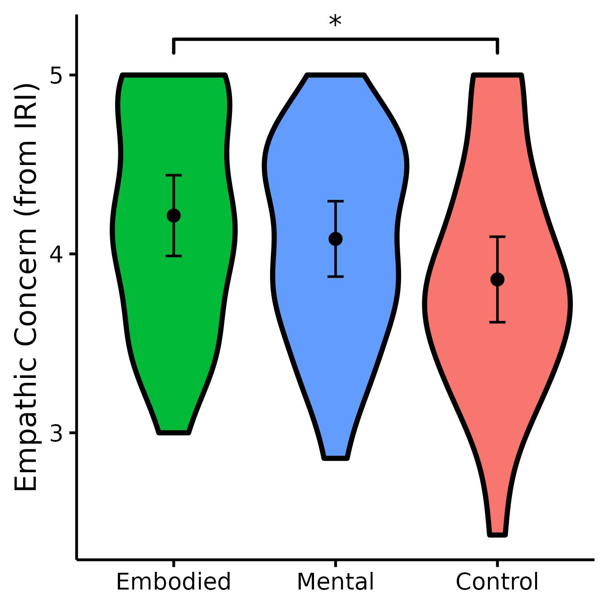
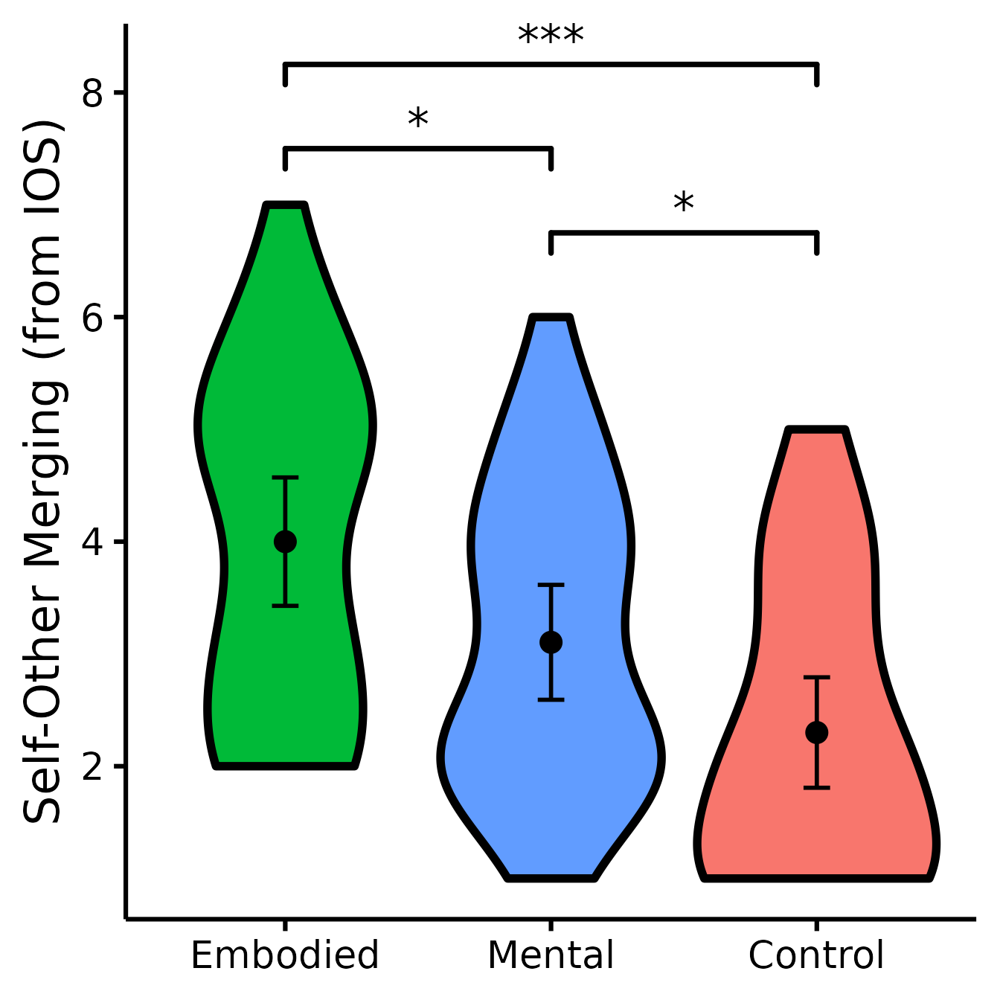
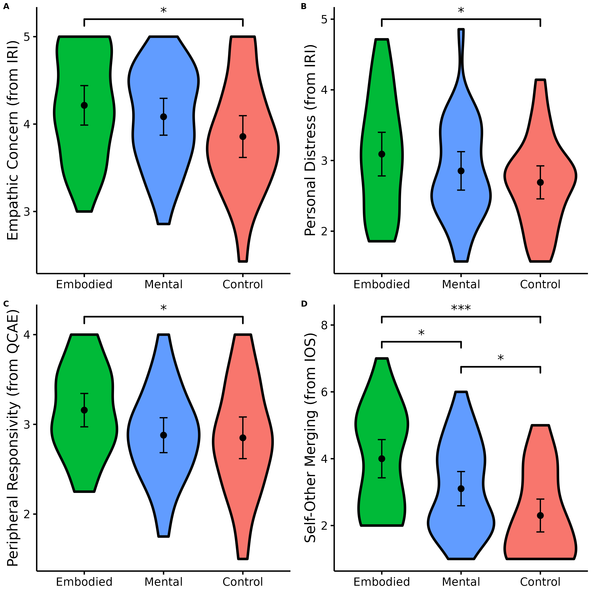

# Planned Contrasts Analyses (Group Comparisons)

## Basic Idea

In this post, I will document how I conduct planned contrasts analyses
to test whether experimental groups differ from each other. Planned
contrasts are similar to *t* tests, but provide more power when you have
several groups:

> Statistical power is lower with the standard *t* test compared than it
> is with the planned contrast version for two reasons: a) the sample
> size is smaller with the *t* test, because only the cases in the two
> groups are selected; and b) in the planned contrast the error term is
> smaller than it is with the standard *t* test because it is based on
> all the cases
> ([source](https://web.pdx.edu/~newsomj/uvclass/ho_planned%20contrasts.pdf))

I will first demonstrate a simple example for conducting the analysis,
exporting the table of results to Microsoft Word, and producing the
figure. After demonstrating it for a single variable, we will then look
at a full workflow, i.e., how we can automatize the process for several
variables simultaneously.

### Getting started

For the minimal example, we will use the `iris` dataset, which is
installed with `R` by default.

### Using `nice_contrasts()`

**Load the `rempsyc` package:**

``` r
library(rempsyc)
```

> ***Note:*** If you haven’t installed this package yet, you will need
> to install it via the following command:
> `install.packages("rempsyc")`. Furthermore, you may be asked to
> install the following packages if you haven’t installed them already
> (you may decide to install them all now to avoid interrupting your
> workflow if you wish to follow this tutorial from beginning to end):

``` r
pkgs <- c(
  "bootES", "emmeans", "flextable", "ggplot2", "boot",
  "ggsignif", "ggpubr"
)
install_if_not_installed(pkgs)
```

------------------------------------------------------------------------

Let’s test out the function on existing data

``` r
set.seed(100)
table.stats <- nice_contrasts(
  response = "Sepal.Length",
  group = "Species",
  data = iris
)
table.stats
```

    ##   Dependent Variable             Comparison  df          t            p
    ## 1       Sepal.Length    setosa - versicolor 147  -9.032819 8.770194e-16
    ## 2       Sepal.Length     setosa - virginica 147 -15.365506 2.214821e-32
    ## 3       Sepal.Length versicolor - virginica 147  -6.332686 2.765638e-09
    ##           d CI_lower   CI_upper
    ## 1 -1.806564 -2.17235 -1.4111701
    ## 2 -3.073101 -3.52209 -2.4497683
    ## 3 -1.266537 -1.71202 -0.7930314

This will give us Cohen’s *d* by default for the effect size, but it is
possible to request the ‘robust’ version (i.e., robust to deviations
from parametric assumptions) of Cohen’s *d* by specifying
`effect.type = "akp.robust.d"`. It will also provide us with
bootstrapped 95% confidence intervals of that effect size.

### Make it publication-ready using [`nice_table()`](https://rempsyc.remi-theriault.com/articles/table.md).

``` r
(my_table <- nice_table(table.stats))
```

| Dependent Variable | Comparison             | df  | t      | p             | d     | 95% CI           |
|--------------------|------------------------|-----|--------|---------------|-------|------------------|
| Sepal.Length       | setosa - versicolor    | 147 | -9.03  | \< .001\*\*\* | -1.81 | \[-2.17, -1.41\] |
|                    | setosa - virginica     | 147 | -15.37 | \< .001\*\*\* | -3.07 | \[-3.52, -2.45\] |
|                    | versicolor - virginica | 147 | -6.33  | \< .001\*\*\* | -1.27 | \[-1.71, -0.79\] |

**Open (or save) the table to Word**

``` r
# Open in Word
print(my_table, preview = "docx")

# Save in Word
flextable::save_as_docx(my_table, path = "contrasts.docx")
```

### Make a violin plot comparing groups through [`nice_violin()`](https://rempsyc.remi-theriault.com/articles/violin.md).

``` r
(figure <- nice_violin(
  group = "Species",
  response = "Sepal.Length",
  data = iris,
  ytitle = "Length of Sepal",
  signif_annotation = c("***", "***", "***"),
  signif_yposition = c(8.7, 7.3, 8.2),
  signif_xmin = c("setosa", "setosa", "versicolor"),
  signif_xmax = c("virginica", "versicolor", "virginica")
))
```


Let’s save a high-resolution/vector version of this figure in PDF (it
could be .png or any other format too if necessary).

``` r
ggplot2::ggsave("Figure 1.pdf", figure,
  width = 7, height = 7,
  unit = "in", dpi = 300
)
```

Congratulations for making it that far! You’ve done it! From A to Z, you
now know how to make things work! If you would like to integrate this
with a broader workflow, read on for the next part!

## Full Workflow

For the full workflow, we will use the dataset from one of my studies
published at the *Quarterly Journal of Experimental Psychology*
(<https://doi.org/10.1177/17470218211024826>) and available on the Open
Science Framework.

**Load the data file from the Open Science Framework**

``` r
data <- read.csv("https://osf.io/qkmnp//?action=download", header = TRUE)
```

**Specify the order of factor levels for “Group”** (otherwise R will
alphabetize them)

``` r
(data$Group <- factor(data$Group, levels = c("Embodied", "Mental", "Control")))
```

    ##  [1] Embodied Embodied Control  Control  Mental   Embodied Control  Control 
    ##  [9] Control  Embodied Mental   Mental   Control  Control  Mental   Control 
    ## [17] Mental   Mental   Embodied Embodied Control  Embodied Mental   Control 
    ## [25] Embodied Embodied Mental   Control  Mental   Embodied Embodied Mental  
    ## [33] Mental   Mental   Embodied Mental   Embodied Mental   Control  Embodied
    ## [41] Mental   Mental   Embodied Mental   Mental   Embodied Control  Control 
    ## [49] Control  Mental   Embodied Control  Embodied Control  Mental   Embodied
    ## [57] Embodied Embodied Control  Control  Control  Control  Mental   Control 
    ## [65] Mental   Embodied Embodied Mental   Embodied Control  Control  Mental  
    ## [73] Mental   Control  Control  Embodied Mental   Control  Embodied Embodied
    ## [81] Embodied Mental   Control  Control  Embodied Mental   Mental   Mental  
    ## [89] Embodied Control 
    ## Levels: Embodied Mental Control

**Define our dependent variables**

``` r
library(dplyr)
(DV <- data %>% select(QCAEPR:IOS) %>% names())
```

    ## [1] "QCAEPR" "IRIPT"  "IRIFS"  "IRIEC"  "IRIPD"  "IOS"

``` r
set.seed(100)
table.stats <- nice_contrasts(
  response = DV,
  group = "Group",
  data = data
)
table.stats
```

    ##    Dependent Variable         Comparison df           t            p
    ## 1              QCAEPR  Embodied - Mental 87  1.95858612 5.336471e-02
    ## 2              QCAEPR Embodied - Control 87  2.19599050 3.075313e-02
    ## 3              QCAEPR   Mental - Control 87  0.23740438 8.129013e-01
    ## 4               IRIPT  Embodied - Mental 86  0.10212396 9.188960e-01
    ## 5               IRIPT Embodied - Control 86  0.12249596 9.027921e-01
    ## 6               IRIPT   Mental - Control 86  0.01932946 9.846231e-01
    ## 7               IRIFS  Embodied - Mental 86  1.53639996 1.281114e-01
    ## 8               IRIFS Embodied - Control 86  0.15139155 8.800214e-01
    ## 9               IRIFS   Mental - Control 86 -1.38629687 1.692400e-01
    ## 10              IRIEC  Embodied - Mental 86  0.83396371 4.066119e-01
    ## 11              IRIEC Embodied - Control 86  2.30118373 2.379970e-02
    ## 12              IRIEC   Mental - Control 86  1.44763512 1.513548e-01
    ## 13              IRIPD  Embodied - Mental 86  1.25380051 2.133121e-01
    ## 14              IRIPD Embodied - Control 86  2.13034255 3.599933e-02
    ## 15              IRIPD   Mental - Control 86  0.85841114 3.930517e-01
    ## 16                IOS  Embodied - Mental 87  2.58466812 1.141344e-02
    ## 17                IOS Embodied - Control 87  4.70778837 9.385982e-06
    ## 18                IOS   Mental - Control 87  2.12312024 3.658408e-02
    ##               d    CI_lower  CI_upper
    ## 1   0.505704762  0.03870075 0.9766236
    ## 2   0.567002309  0.00000000 1.0954731
    ## 3   0.061297547 -0.49702900 0.5778342
    ## 4   0.026594635 -0.46573972 0.5197867
    ## 5   0.031628320 -0.51798881 0.5856141
    ## 6   0.005033685 -0.47194500 0.5173597
    ## 7   0.400101948 -0.11432589 0.9221966
    ## 8   0.039089129 -0.46579483 0.5812287
    ## 9  -0.361012819 -0.88082251 0.1441658
    ## 10  0.217176852 -0.28085914 0.7297871
    ## 11  0.594163085  0.06201354 1.1311038
    ## 12  0.376986233 -0.13725213 0.9109306
    ## 13  0.326508748 -0.22692882 0.8678931
    ## 14  0.550052081  0.04289039 1.0712808
    ## 15  0.223543334 -0.27067820 0.6814547
    ## 16  0.667358440  0.11416885 1.1662062
    ## 17  1.215545729  0.62891072 1.7258581
    ## 18  0.548187290  0.04830234 1.0436442

**Add more meaningful names for measures**

``` r
table.stats[1] <- rep(c(
  "Peripheral Responsivity (QCAE)",
  "Perspective-Taking (IRI)",
  "Fantasy (IRI)", "Empathic Concern (IRI)",
  "Personal Distress (IRI)",
  "Inclusion of Other in the Self (IOS)"
), each = 3)
```

### Make it publication-ready using [nice_table()](https://rempsyc.remi-theriault.com/articles/table.md).

Note that with option `highlight = TRUE`, it will automatically
highlight significant results.

``` r
(my_table <- nice_table(table.stats,
  highlight = TRUE,
  title = c("Table 1", "Results of multiple regression with planned contrasts analyses for empathy subscales and self–other merging (confirmatory analyses with the exception of self–other merging)"),
  note = "\U1D451\U1D3F = robust Cohen’s \U1D451; CI = bootstrapped confidence interval. The comparisons were between-groups only (i.e., there were no within-subject pre/post comparisons). One participant did not complete the Interpersonal Reactivity Index. Bold/Grey background values represent statistically significant differences between the groups on that row and variable."
))
```

| Table 1                                                                                                                                                                                                                                                                                                                                                               |                    |     |       |               |       |                 |
|-----------------------------------------------------------------------------------------------------------------------------------------------------------------------------------------------------------------------------------------------------------------------------------------------------------------------------------------------------------------------|--------------------|-----|-------|---------------|-------|-----------------|
| Results of multiple regression with planned contrasts analyses for empathy subscales and self–other merging (confirmatory analyses with the exception of self–other merging)                                                                                                                                                                                          |                    |     |       |               |       |                 |
| Dependent Variable                                                                                                                                                                                                                                                                                                                                                    | Comparison         | df  | t     | p             | d     | 95% CI          |
| Peripheral Responsivity (QCAE)                                                                                                                                                                                                                                                                                                                                        | Embodied - Mental  | 87  | 1.96  | .053          | 0.51  | \[0.04, 0.98\]  |
|                                                                                                                                                                                                                                                                                                                                                                       | Embodied - Control | 87  | 2.20  | .031\*        | 0.57  | \[0.00, 1.10\]  |
|                                                                                                                                                                                                                                                                                                                                                                       | Mental - Control   | 87  | 0.24  | .813          | 0.06  | \[-0.50, 0.58\] |
| Perspective-Taking (IRI)                                                                                                                                                                                                                                                                                                                                              | Embodied - Mental  | 86  | 0.10  | .919          | 0.03  | \[-0.47, 0.52\] |
|                                                                                                                                                                                                                                                                                                                                                                       | Embodied - Control | 86  | 0.12  | .903          | 0.03  | \[-0.52, 0.59\] |
|                                                                                                                                                                                                                                                                                                                                                                       | Mental - Control   | 86  | 0.02  | .985          | 0.01  | \[-0.47, 0.52\] |
| Fantasy (IRI)                                                                                                                                                                                                                                                                                                                                                         | Embodied - Mental  | 86  | 1.54  | .128          | 0.40  | \[-0.11, 0.92\] |
|                                                                                                                                                                                                                                                                                                                                                                       | Embodied - Control | 86  | 0.15  | .880          | 0.04  | \[-0.47, 0.58\] |
|                                                                                                                                                                                                                                                                                                                                                                       | Mental - Control   | 86  | -1.39 | .169          | -0.36 | \[-0.88, 0.14\] |
| Empathic Concern (IRI)                                                                                                                                                                                                                                                                                                                                                | Embodied - Mental  | 86  | 0.83  | .407          | 0.22  | \[-0.28, 0.73\] |
|                                                                                                                                                                                                                                                                                                                                                                       | Embodied - Control | 86  | 2.30  | .024\*        | 0.59  | \[0.06, 1.13\]  |
|                                                                                                                                                                                                                                                                                                                                                                       | Mental - Control   | 86  | 1.45  | .151          | 0.38  | \[-0.14, 0.91\] |
| Personal Distress (IRI)                                                                                                                                                                                                                                                                                                                                               | Embodied - Mental  | 86  | 1.25  | .213          | 0.33  | \[-0.23, 0.87\] |
|                                                                                                                                                                                                                                                                                                                                                                       | Embodied - Control | 86  | 2.13  | .036\*        | 0.55  | \[0.04, 1.07\]  |
|                                                                                                                                                                                                                                                                                                                                                                       | Mental - Control   | 86  | 0.86  | .393          | 0.22  | \[-0.27, 0.68\] |
| Inclusion of Other in the Self (IOS)                                                                                                                                                                                                                                                                                                                                  | Embodied - Mental  | 87  | 2.58  | .011\*        | 0.67  | \[0.11, 1.17\]  |
|                                                                                                                                                                                                                                                                                                                                                                       | Embodied - Control | 87  | 4.71  | \< .001\*\*\* | 1.22  | \[0.63, 1.73\]  |
|                                                                                                                                                                                                                                                                                                                                                                       | Mental - Control   | 87  | 2.12  | .037\*        | 0.55  | \[0.05, 1.04\]  |
| Note. 𝑑ᴿ = robust Cohen’s 𝑑; CI = bootstrapped confidence interval. The comparisons were between-groups only (i.e., there were no within-subject pre/post comparisons). One participant did not complete the Interpersonal Reactivity Index. Bold/Grey background values represent statistically significant differences between the groups on that row and variable. |                    |     |       |               |       |                 |

**Open (or save) the table to Word**

``` r
# Open in Word
print(my_table, preview = "docx")

# Save in Word
flextable::save_as_docx(my_table, path = "contrasts.docx")
```

### Make violin plots comparing groups through [`nice_violin`](https://rempsyc.remi-theriault.com/articles/violin.md).

We will have to make the four figures for which comparisons were
significant and then combine them in one plot.

This function will throw an error if your dataset contains missing data.
We will omit those rows missing data for now.

``` r
Data <- na.omit(data)
```

**Make figure panel 1**

``` r
(EC <- nice_violin(
  group = "Group",
  response = "IRIEC",
  data = Data,
  colours = c("#00BA38", "#619CFF", "#F8766D"),
  ytitle = "Empathic Concern (from IRI)",
  signif_annotation = "*",
  signif_yposition = 5.2,
  signif_xmin = 1,
  signif_xmax = 3
))
```



**Make figure panel 2**

``` r
(PD <- nice_violin(
  group = "Group",
  response = "IRIPD",
  data = Data,
  colours = c("#00BA38", "#619CFF", "#F8766D"),
  ytitle = "Personal Distress (from IRI)",
  signif_annotation = "*",
  signif_yposition = 5,
  signif_xmin = 1,
  signif_xmax = 3
))
```


**Make figure panel 3**

``` r
(PR <- nice_violin(
  group = "Group",
  response = "QCAEPR",
  data = Data,
  colours = c("#00BA38", "#619CFF", "#F8766D"),
  ytitle = "Peripheral Responsivity (from QCAE)",
  signif_annotation = "*",
  signif_yposition = 4.2,
  signif_xmin = 1,
  signif_xmax = 3
))
```


**Make figure panel 4**

``` r
(IOS <- nice_violin(
  group = "Group",
  response = "IOS",
  data = Data,
  colours = c("#00BA38", "#619CFF", "#F8766D"),
  ytitle = "Self-Other Merging (from IOS)",
  signif_annotation = c("***", "*", "*"),
  signif_yposition = c(8.25, 7.5, 6.75),
  signif_xmin = c(1, 1, 2),
  signif_xmax = c(3, 2, 3)
))
```



It’s now time to combine our four plots into one figure! Yeah!

``` r
library(ggpubr)
(figure <- ggarrange(EC, PD, PR, IOS,
  labels = "AUTO",
  ncol = 2, nrow = 2
))
```



Let’s save a high-resolution/vector version of this figure in PDF (it
could be .png or any other format too if necessary).

``` r
ggplot2::ggsave("Figure 1.pdf", figure,
  width = 14, height = 14,
  unit = "in", dpi = 300
)
```

### Thanks for checking in

Make sure to check out this page again if you use the code after a time
or if you encounter errors, as I periodically update or improve the
code. Feel free to contact me for comments, questions, or requests to
improve this function at <https://github.com/rempsyc/rempsyc/issues>.
See all tutorials here: <https://remi-theriault.com/tutorials>.
