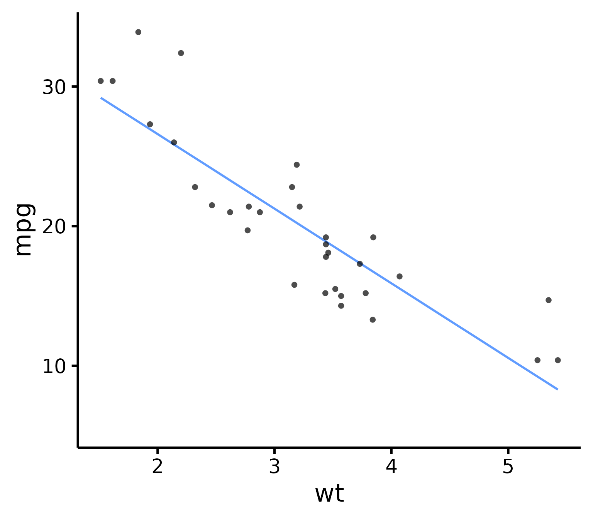
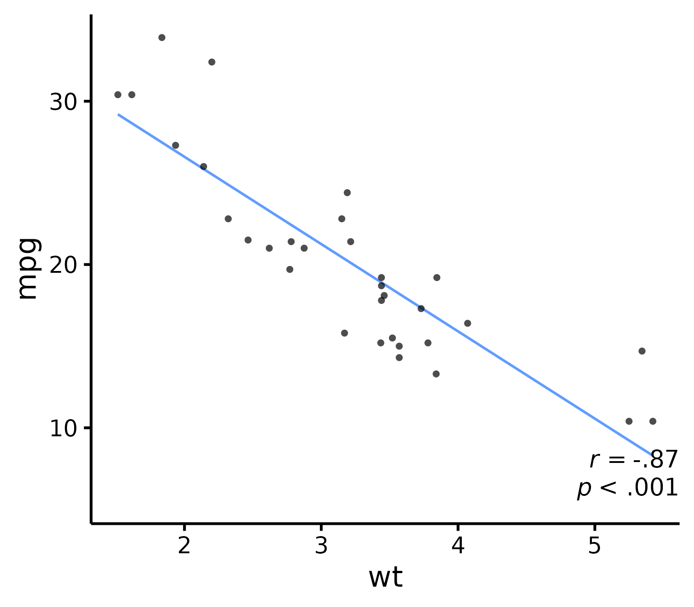
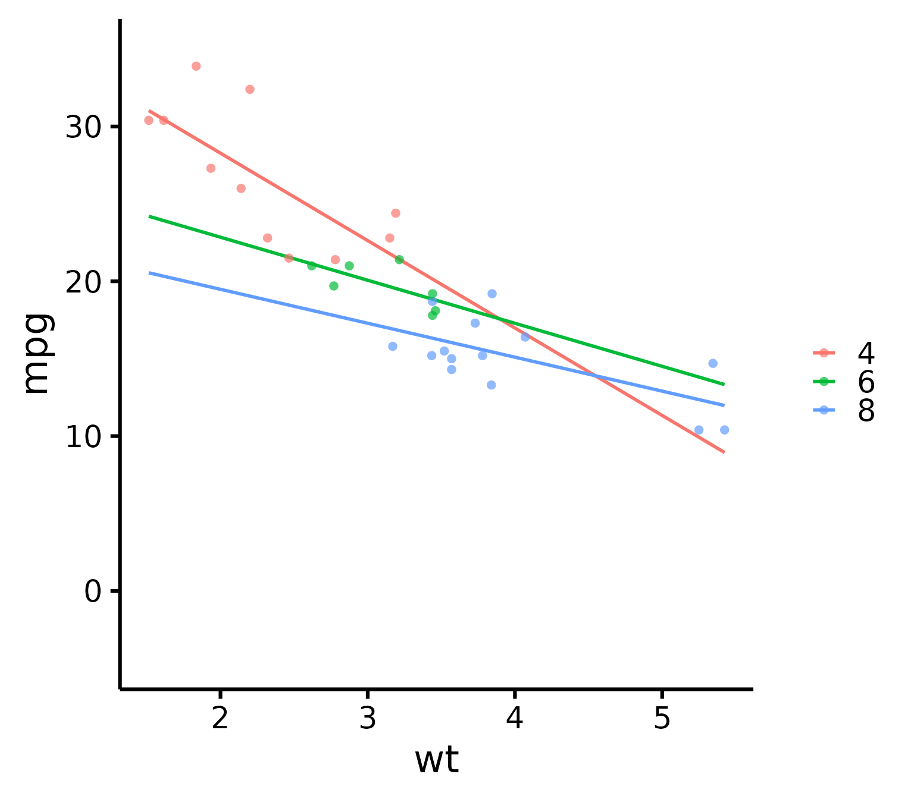
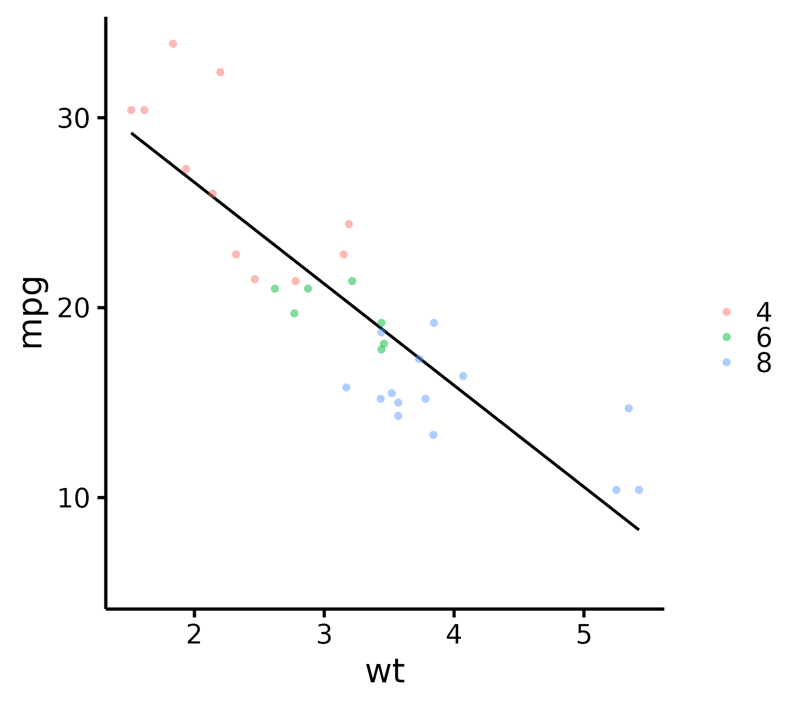

# Publication-ready scatter plots in R

## Basic idea

After the
[`nice_violin()`](https://rempsyc.remi-theriault.com/reference/nice_violin.md)
function, here’s how to make nice scatter plots easily!

Let’s first load the demo data. This data set comes with base `R`
(meaning you have it too and can directly type this command into your
`R` console).

``` r
data("mtcars")
head(mtcars)
```

    ##                    mpg cyl disp  hp drat    wt  qsec vs am gear carb
    ## Mazda RX4         21.0   6  160 110 3.90 2.620 16.46  0  1    4    4
    ## Mazda RX4 Wag     21.0   6  160 110 3.90 2.875 17.02  0  1    4    4
    ## Datsun 710        22.8   4  108  93 3.85 2.320 18.61  1  1    4    1
    ## Hornet 4 Drive    21.4   6  258 110 3.08 3.215 19.44  1  0    3    1
    ## Hornet Sportabout 18.7   8  360 175 3.15 3.440 17.02  0  0    3    2
    ## Valiant           18.1   6  225 105 2.76 3.460 20.22  1  0    3    1

### Getting started

Load the `rempsyc` package:

``` r
library(rempsyc)
```

> ***Note:*** If you haven’t installed this package yet, you will need
> to install it via the following command:
> `install.packages("rempsyc")`. Furthermore, you may be asked to
> install the following packages if you haven’t installed them already
> (you may decide to install them all now to avoid interrupting your
> workflow if you wish to follow this tutorial from beginning to end):

``` r
install_if_not_installed("ggplot2")
```

------------------------------------------------------------------------

``` r
nice_scatter(
  data = mtcars,
  predictor = "wt",
  response = "mpg"
)
```



``` r
### Save a high-resolution image file to specified directory
ggplot2::ggsave("nice_scatterplothere.pdf",
  width = 7, height = 7,
  unit = "in", dpi = 300
)
# Change the path to where you would like to save it.
# If you copy-paste your path name, remember to
# use "R" slashes ('/' rather than '\').
# Also remember to specify the .tiff extension of the file.
```

> **Pro tip**: Recommended dimensions for saving is 7 inches wide and 7
> inches high. The `.pdf` or `.eps` formats are recommended for scalable
> vector graphics for high-resolution submissions to scientific
> journals. However, you can also save in other formats, such as
> `.tiff`, `.png`, or `.jpg`.

## Customization

### Change x- and y- axis labels

``` r
nice_scatter(
  data = mtcars,
  predictor = "wt",
  response = "mpg",
  ytitle = "Miles/(US) gallon",
  xtitle = "Weight (1000 lbs)"
)
```


### Have points “jittered”

Meaning randomly moved around a bit to prevent overplotting (when two or
more points overlap, thus hiding information).

``` r
nice_scatter(
  data = mtcars,
  predictor = "wt",
  response = "mpg",
  has.jitter = TRUE
)
```


### Change the transparency of the points

``` r
nice_scatter(
  data = mtcars,
  predictor = "wt",
  response = "mpg",
  alpha = 1
) # default is 0.7
```


### Remove points

``` r
nice_scatter(
  data = mtcars,
  predictor = "wt",
  response = "mpg",
  has.points = FALSE,
  has.jitter = FALSE
)
```


### Add confidence band

``` r
nice_scatter(
  data = mtcars,
  predictor = "wt",
  response = "mpg",
  has.confband = TRUE
)
```


### Set x- and y- scales manually

``` r
nice_scatter(
  data = mtcars,
  predictor = "wt",
  response = "mpg",
  xmin = 1,
  xmax = 6,
  xby = 1,
  ymin = 10,
  ymax = 35,
  yby = 5
)
```


### Change plot colour

``` r
nice_scatter(
  data = mtcars,
  predictor = "wt",
  response = "mpg",
  colours = "blueviolet"
)
```


### Add correlation coefficient to plot and p-value

``` r
nice_scatter(
  data = mtcars,
  predictor = "wt",
  response = "mpg",
  has.r = TRUE,
  has.p = TRUE
)
```



### Change location of correlation coefficient or p-value

``` r
nice_scatter(
  data = mtcars,
  predictor = "wt",
  response = "mpg",
  has.r = TRUE,
  r.x = 4,
  r.y = 25,
  has.p = TRUE,
  p.x = 5,
  p.y = 20
)
```


### Plot by group

``` r
nice_scatter(
  data = mtcars,
  predictor = "wt",
  response = "mpg",
  group = "cyl"
)
```


### Use full range on the slope/confidence band

``` r
nice_scatter(
  data = mtcars,
  predictor = "wt",
  response = "mpg",
  group = "cyl",
  has.fullrange = TRUE
)
```



### Change order of labels on the legend

``` r
nice_scatter(
  data = mtcars,
  predictor = "wt",
  response = "mpg",
  group = "cyl",
  groups.order = c(8, 4, 6)
)
```


``` r
# These are the levels of 'mtcars$cyl', so we place lvl 8
# first, then lvl 4, etc.
```

### Change legend labels

``` r
nice_scatter(
  data = mtcars,
  predictor = "wt",
  response = "mpg",
  group = "cyl",
  groups.labels = c("Weak", "Average", "Powerful")
)
```


``` r
# Warning: This applies after changing order of level
```

    **Warning**: This only changes labels and applies after changing order of level!
    Always use `groups.order` first if you also need to use `groups.labels`!
    This is to make sure to have the right labels for the right groups!

### Add a title to legend

``` r
nice_scatter(
  data = mtcars,
  predictor = "wt",
  response = "mpg",
  group = "cyl",
  legend.title = "Cylinders"
)
```


### Plot by group + manually specify colours

``` r
nice_scatter(
  data = mtcars,
  predictor = "wt",
  response = "mpg",
  group = "cyl",
  colours = c("burlywood", "darkgoldenrod", "chocolate")
)
```


### Plot by group + use different line types for each group

``` r
nice_scatter(
  data = mtcars,
  predictor = "wt",
  response = "mpg",
  group = "cyl",
  has.linetype = TRUE
)
```


### Plot by group + use different point shapes for each group

``` r
nice_scatter(
  data = mtcars,
  predictor = "wt",
  response = "mpg",
  group = "cyl",
  has.shape = TRUE
)
```


### Plot by group, point shapes, line types, legend + no colours (black and white)

``` r
nice_scatter(
  data = mtcars,
  predictor = "wt",
  response = "mpg",
  group = "cyl",
  legend.title = "Cylinders",
  has.linetype = TRUE,
  has.shape = TRUE,
  colours = rep("black", 3)
)
```


### Putting it all together

If you’d like to see all available options at once (a bit long):

``` r
nice_scatter(
  data = mtcars,
  predictor = "wt",
  response = "mpg",
  ytitle = "Miles/(US) gallon",
  xtitle = "Weight (1000 lbs)",
  has.points = FALSE,
  has.jitter = TRUE,
  alpha = 1,
  has.confband = TRUE,
  has.fullrange = FALSE,
  group = "cyl",
  has.linetype = TRUE,
  has.shape = TRUE,
  xmin = 1,
  xmax = 6,
  xby = 1,
  ymin = 10,
  ymax = 35,
  yby = 5,
  has.r = TRUE,
  has.p = TRUE,
  r.x = 5.5,
  r.y = 25,
  colours = c("burlywood", "darkgoldenrod", "chocolate"),
  legend.title = "Cylinders",
  groups.labels = c("Weak", "Average", "Powerful")
)
```


## Special situation: Add group average

There’s no straightforward way to add group average, so here’s a hack to
do it. We first have to create a second data set with another “group”
that will be used as the average.

### Black line + coloured lines

``` r
# This simply copies the 'mtcars' dataset
new.Data <- mtcars
# That would be your "Group" variable normally
# And this operation fills all cells of that column with the word
# "Average" to identify our new 'group'
new.Data$cyl <- "Average"
# This adds the new "Average" group rows to the original data rows
XData <- rbind(mtcars, new.Data)
```

Then we need to create a FIRST layer of just the slopes. We add
transparency to the group lines except the group average to emphasize
the group average (with the new argument `groups.alpha`).

``` r
(p <- nice_scatter(
  data = XData,
  predictor = "wt",
  response = "mpg",
  has.points = FALSE,
  group = "cyl",
  colours = c("black", "#00BA38", "#619CFF", "#F8766D"),
  # We add colours manually because we want average to be black to stand out
  groups.order = c("Average", "4", "6", "8"),
  # We do this to have average on top since it's the most important
  groups.alpha = c(1, 0.5, 0.5, 0.5)
))
```


``` r
# This adds 50% transparency to all lines except
# the first one (Average) which is 100%
```

Finally we are ready to add a SECOND layer of just the points on top of
our previous layer. We use standard `ggplot` syntax for this.

``` r
library(ggplot2)
p + geom_point(
  data = mtcars,
  size = 2,
  alpha = 0.5,
  shape = 16,
  # We use shape 16 because the default shape 19 sometimes
  # causes problems when exporting to PDF
  mapping = aes(
    x = wt,
    y = mpg,
    colour = factor(cyl),
    fill = factor(cyl)
  )
)
```


### Black line, coloured dots

If you’d like instead to still show the group points but only the black
average line, you can do the following as first layer:

``` r
(p <- nice_scatter(
  data = mtcars,
  predictor = "wt",
  response = "mpg",
  has.points = FALSE,
  has.legend = TRUE,
  # Important argument! Else the next legend won't appear on the second layer!
  colours = "black"
))
```


Then to add the points as second layer we do the same as before:

``` r
p + geom_point(
  data = mtcars,
  size = 2,
  alpha = 0.5,
  shape = 16,
  mapping = aes(
    x = wt,
    y = mpg,
    colour = factor(cyl)
  )
)
```



### Thanks for checking in

Make sure to check out this page again if you use the code after a time
or if you encounter errors, as I periodically update or improve the
code. Feel free to contact me for comments, questions, or requests to
improve this function at <https://github.com/rempsyc/rempsyc/issues>.
See all tutorials here: <https://remi-theriault.com/tutorials>.
