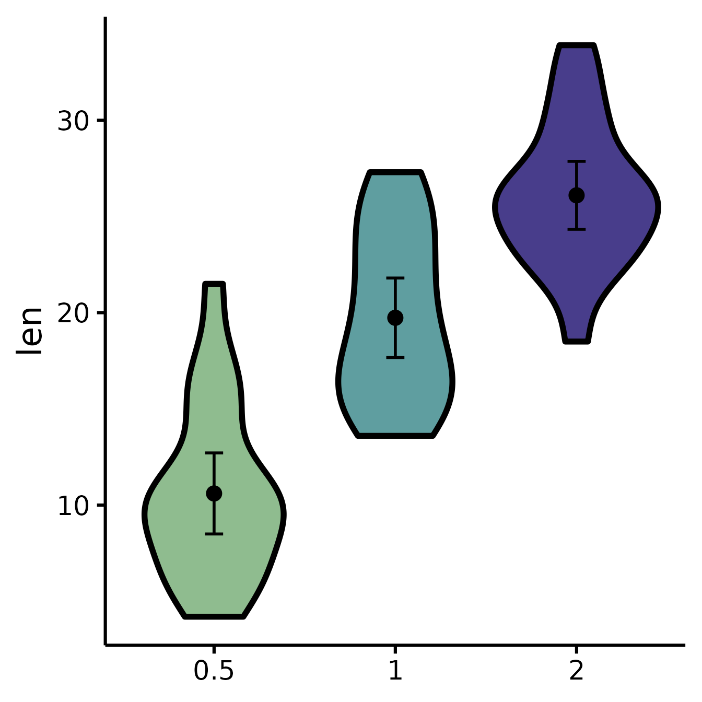
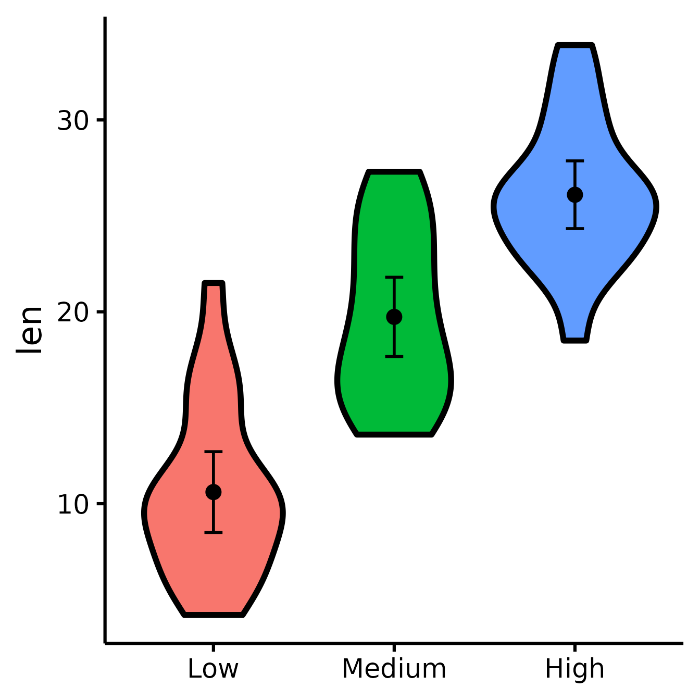
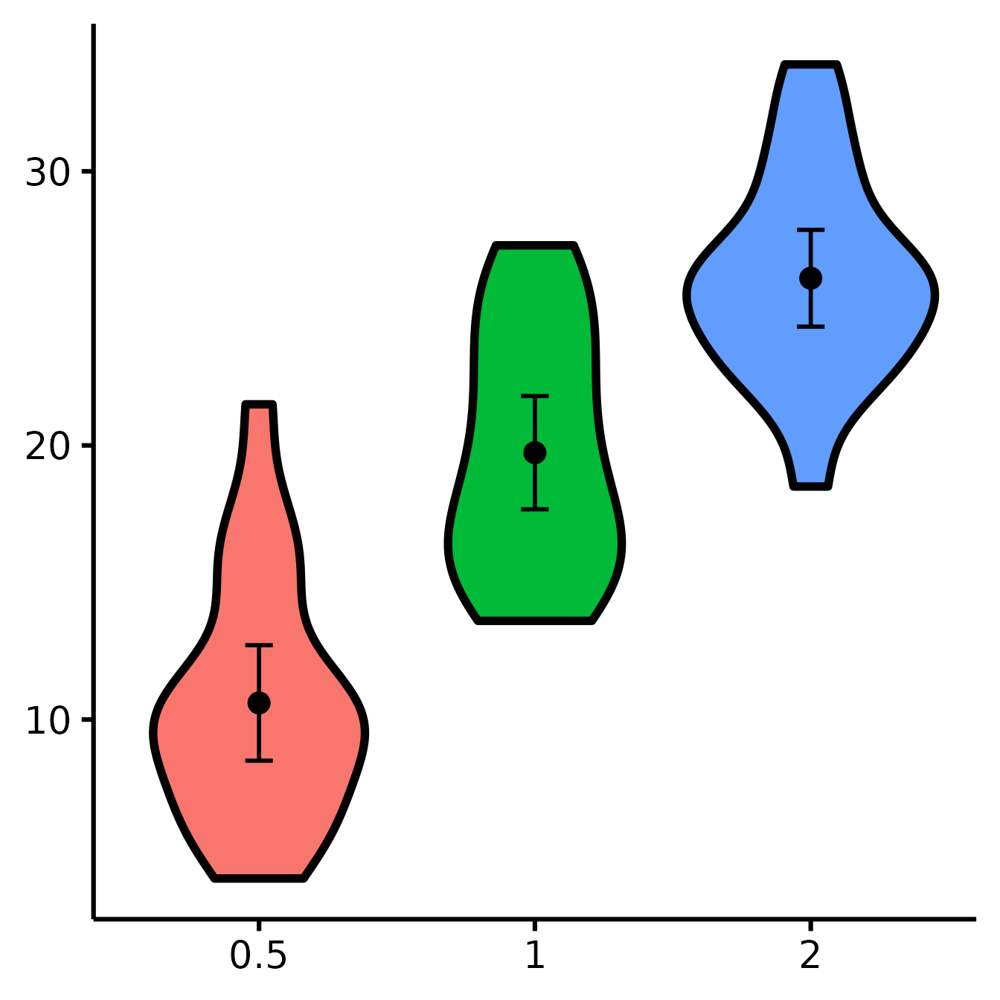
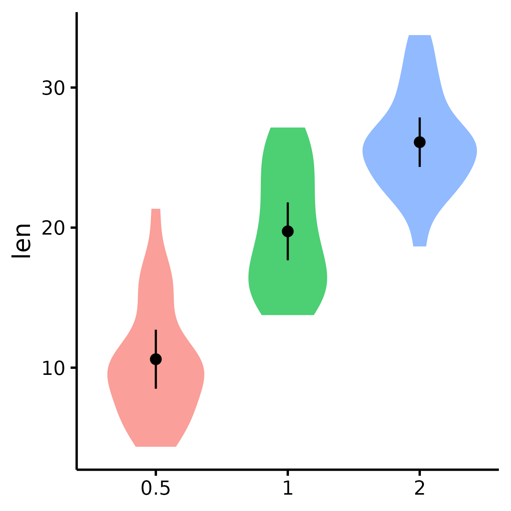
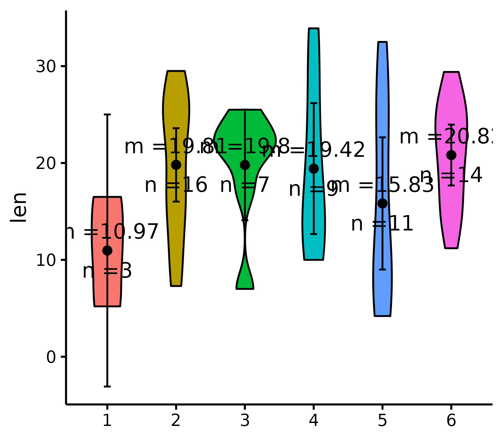

# Publication-ready violin plots in R

## Getting started

I happened to have lots of plots to do with slight variations, so I made
a function to make my life easier.

**This function, in particular, serves to compare 2 or more experimental
groups (although it will still plot with 1 group).** We use violin plots
instead of bar plots because they provide more information for the same
space (precisely, the distribution density/frequency of responses, which
allows you to visually estimate normality, skewness, and kurtosis).

Let’s first load the demo data. This data set comes with base `R`
(meaning you have it too and can directly type this command into your
`R` console).

``` r
data("ToothGrowth")
head(ToothGrowth)
```

    ##    len supp dose
    ## 1  4.2   VC  0.5
    ## 2 11.5   VC  0.5
    ## 3  7.3   VC  0.5
    ## 4  5.8   VC  0.5
    ## 5  6.4   VC  0.5
    ## 6 10.0   VC  0.5

Load the `rempsyc` package:

``` r
library(rempsyc)
```

> ***Note:*** If you haven’t installed this package yet, you will need
> to install it via the following command:
> `install.packages("rempsyc")`. Furthermore, you may be asked to
> install the following packages if you haven’t installed them already
> (you may decide to install them all now to avoid interrupting your
> workflow if you wish to follow this tutorial from beginning to end):

``` r
pkgs <- c("ggplot2", "boot", "psych")
install_if_not_installed(pkgs)
```

------------------------------------------------------------------------

``` r
nice_violin(
  data = ToothGrowth,
  group = "dose",
  response = "len"
)
```


    Dots = means
    Error bars = 95% confidence intervals
    Width = distribution density (frequency)

### Save a high-resolution image file to specified directory

``` r
ggplot2::ggsave("nice_violinplothere.pdf",
  width = 7, height = 7,
  unit = "in", dpi = 300
)
# Change the path to where you would like to save it.
# If you copy-paste your path name,
# remember to use "R" slashes ('/' rather than '\').
# Also remember to specify the .tiff extension of the file.
```

> **Pro tip**: Recommended dimensions for saving is 7 inches wide and 7
> inches high. The `.pdf` or `.eps` formats are recommended for scalable
> vector graphics for high-resolution submissions to scientific
> journals. However, you can also save in other formats, such as
> `.tiff`, `.png`, or `.jpg`.

## Customization

### Change x- and y- axes labels

``` r
nice_violin(
  data = ToothGrowth,
  group = "dose",
  response = "len",
  ytitle = "Length of Tooth",
  xtitle = "Vitamin C Dosage"
)
```


### See difference between two groups

To see if two groups are statistically significantly different.

``` r
nice_violin(
  data = ToothGrowth,
  group = "dose",
  response = "len",
  comp1 = "0.5",
  comp2 = "2"
)
```


### See difference between two other groups

You can also select groups based on their position on the x-axis (notice
no quotes this time).

``` r
nice_violin(
  data = ToothGrowth,
  group = "dose",
  response = "len",
  comp1 = 2,
  comp2 = 3
)
```


### Compare all three groups

What if you want to look at all three groups at the same time?
Unfortunately, the underlying package we use, `ggsignif`, does not allow
the comparison of more than one group at once. So we need to tweak this
manually instead. (Note that we can also use this technique when the
significance computed with `ggsignif` does not correspond to the number
of stars we want to use, for example if we use a different *p*-value or
not a *t*-test.)

``` r
nice_violin(
  data = ToothGrowth,
  group = "dose",
  response = "len",
  signif_annotation = c("*", "**", "***"), # manually enter the number of stars
  signif_yposition = c(30, 36, 40), # What height (y) should the stars appear?
  signif_xmin = c(1, 2, 1), # Where should the left-sided brackets start (x)?
  signif_xmax = c(2, 3, 3)
) # Where should the right-sided brackets end (x)?
```


### Include effect size (Cohen’s *d*)

``` r
nice_violin(
  data = mtcars,
  group = "am",
  response = "mpg",
  comp1 = 1,
  comp2 = 2,
  has.d = TRUE
)
```


### Set the colours manually

``` r
nice_violin(
  data = ToothGrowth,
  group = "dose",
  response = "len",
  colours = c("darkseagreen", "cadetblue", "darkslateblue")
)
```



### Changing the names of the x-axis labels

``` r
nice_violin(
  data = ToothGrowth,
  group = "dose",
  response = "len",
  xlabels = c("Low", "Medium", "High")
)
```



### Removing the x-axis or y-axis titles

``` r
nice_violin(
  data = ToothGrowth,
  group = "dose",
  response = "len",
  ytitle = NULL,
  xtitle = NULL
)
```



### Removing the x-axis or y-axis labels (for whatever purpose)

``` r
nice_violin(
  data = ToothGrowth,
  group = "dose",
  response = "len",
  has.ylabels = FALSE,
  has.xlabels = FALSE
)
```


### Set y-scale manually

``` r
nice_violin(
  data = ToothGrowth,
  group = "dose",
  response = "len",
  ymin = 5,
  ymax = 35,
  yby = 5
)
```


### With x number of groups

``` r
ToothGrowth$six.groups <- sample(1:6, 60, replace = T)
nice_violin(
  data = ToothGrowth,
  group = "six.groups",
  response = "len"
)
```


> **Pro tip**: Save figure with greater width when you have more groups!

### Plotting individual observations

``` r
nice_violin(
  data = ToothGrowth,
  group = "dose",
  response = "len",
  obs = TRUE
)
```


### Micro-Customizations

It is also possible to do several minor adjustments: (a) adjust the
width of the caps (legs) of the confidence intervals with the
`CIcap.width` argument (set it to 0 to get rid of them); (b) define the
level of transparency with the `alpha` argument (1 is no transparency),
(c) define the colour of the violins’ borders with the `border.colour`
argument (default is white which is the equivalent of no borders).

``` r
nice_violin(
  data = ToothGrowth,
  group = "dose",
  response = "len",
  CIcap.width = 0,
  alpha = .70,
  border.colour = "white"
)
```



### Bootstrapping

This function used to give you 95% bootstrapped confidence intervals
(with 2000 bootstraps) for the error bars by default, but bootstrapping
now has to be specified explicitly.

Bootstrapping is a non-parametric technique, meaning that it does not
need to respect the classical parametric assumptions (normality,
homoscedasticity, etc.). In this case it’s just a nice alternative way
to look at your data.

> ***Note:*** bootstrapping requires a number of bootstraps equal or
> higher than your number of observations (rows). Because people
> sometimes work with big datasets, I’ve added an option to specify a
> specific number of bootstraps with the option `bootstraps = 2000`
> (change default to your desired value). But because I’ve recently had
> to work with a very large data set (7 million observations), it was
> impractical to do 7 million bootstraps (that would have been a very,
> very long operation), so I also added an option to turn bootstrapping
> off completely and just use a regular confidence interval instead
> (with `boot = FALSE`, which is now the default).

### Putting it all together

If you’d like to see all available options at once (a bit long):

``` r
nice_violin(
  data = ToothGrowth,
  group = "dose",
  response = "len",
  boot = TRUE,
  bootstraps = 200,
  ytitle = "Length of Tooth",
  xtitle = "Vitamin C Dosage",
  colours = c("darkseagreen", "cadetblue", "darkslateblue"),
  has.ylabels = TRUE,
  has.xlabels = TRUE,
  xlabels = c("Low", "Medium", "High"),
  ymin = 0,
  ymax = 45,
  yby = 15,
  signif_annotation = c("*", "NS", "***"),
  signif_yposition = c(30, 36, 41),
  signif_xmin = c(1, 2, 1),
  signif_xmax = c(2, 3, 3),
  CIcap.width = 0,
  alpha = 0.5,
  border.colour = "black",
  border.size = 1,
  obs = TRUE,
  has.d = TRUE,
  d.x = 1.7,
  d.y = 20
)
```


## Special situation: Add other plot elements

The good thing about this function is that it outputs a `ggplot` object,
which you can continue to use to build on your plot and customize it
further. For instance, I recently wanted to add mean and sample size as
annotations for each group (where I had group sample sizes ranging from
100 to 35,000, so it was important to know which groups were more
representative). For the demonstration, let’s just build the same
multiple-groups plot we did earlier.

``` r
# Create our group variable:
ToothGrowth$groups <- factor(sample(1:6, 60, replace = T))

# Make the plot and save it to object "p"
p <- nice_violin(
  data = ToothGrowth,
  group = "groups",
  response = "len",
  border.size = 1
)
```

Then what I did is that I simply added conventional `ggplot` code to my
plot object. (But first I had to compute the statistics we were going to
be using:)

``` r
# Compute basic statistics and save to object
library(psych) # Install the psych package if you don't already have it
statsSummary <- describeBy(
  x = ToothGrowth$len, group = ToothGrowth$groups, mat = TRUE
)

# Add our annotations! (Warning: a bit more complicated code ahead!)
library(ggplot2)
p + annotate(
  geom = "text",
  # First annotation adds the average
  x = seq(length(levels(ToothGrowth$groups))),
  # Specifies annotations is for all groups/x-axis ticks
  y = statsSummary$mean + 2,
  # Puts mean at mean value on the y-axis (adds 2)
  label = paste0("m =", round(statsSummary$mean, 2))
) +
  # That prints the mean on the plot
  annotate(
    geom = "text",
    # (Second annotation adds the sample size)
    x = seq(length(levels(ToothGrowth$groups))),
    y = statsSummary$mean - 2,
    # Puts sample size at mean value on the y-axis (substracts 2)
    label = paste0("n =", round(statsSummary$n, 2))
  )
```



``` r
# That prints the sample size on the plot
```

### Thanks for checking in

Make sure to check out this page again if you use the code after a time
or if you encounter errors, as I periodically update or improve the
code. Feel free to contact me for comments, questions, or requests to
improve this function at <https://github.com/rempsyc/rempsyc/issues>.
See all tutorials here: <https://remi-theriault.com/tutorials>.
