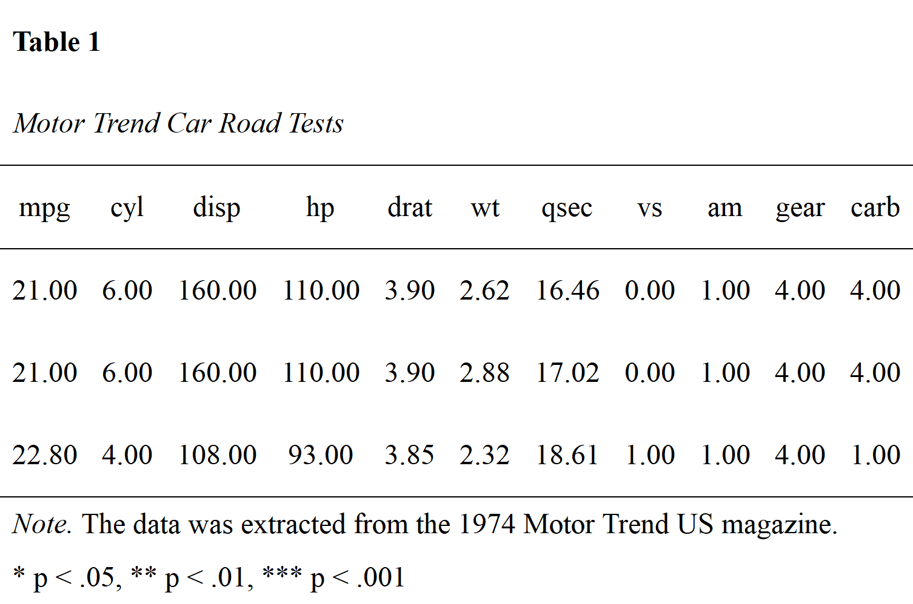

# Summary

{rempsyc} is an R package of convenience functions that make the 
analysis-to-publication workflow faster, easier, and less error-prone. It 
affords easily customizable APA plots (via {ggplot2}) and nice APA tables 
exportable to Word (via {flextable}). It makes it easy to run statistical tests, 
check assumptions, and automatize various tasks. It is a package mostly geared 
at researchers in the psychological sciences but people from all fields can 
benefit from it.

# Statement of need

There are many reasons to use R [@base2021] for analyzing and reporting data 
from research studies. R is more compatible with the ideals of open science 
[@quintana2020]. In contrast to commercial software: (a) it is free to use; (b) 
it makes it easy to share a fully comprehensive analysis script; (c) it is 
transparent as anyone can look at the formulas or algorithms used in a given 
package; (d) the community can quickly contribute new packages based on current 
needs; (e) it generates better-looking figures; and (f) it helps reduce 
copy-paste errors so common in psychology. The latter point is a substantial one 
because according to some estimates, up to 50% of articles in psychology have at 
least one statistical error [@nuijten2016prevalence].

However, R has a major downside for R novices: its steep learning curve due to 
its programmatic interface, in contrast to perhaps more user-friendly 
point-and-click software. Of course, this flexibility is also a strength, as the 
R community can, and increasingly does, mobilize to produce packages that make 
using R as easy as possible [e.g., the _easystats_ ecosystem @easystatsPackage]. 
The {rempsyc} package contributes to this momentum by providing convenience 
functions that remove as much friction as possible between your script and your 
manuscript (in particular, if you are using Microsoft Word).

There are mainly three things that go into a manuscript: text, tables, and 
figures. {rempsyc} does not generate publication-ready text summarizing analyses; 
for this, see the {report} package [@reportPackage]. Instead, {rempsyc} focuses 
on the production of publication-ready tables and figures. Below, I go over
a few quick examples of those.

# Examples Features

## Publication-Ready Tables

Formatting your table properly in R is already a time-consuming task, but 
fortunately several packages take care of the formatting within R [e.g., the 
{broom} or {report} packages, @broom2022; @reportPackage; and there are several
others]. Exporting these formatted tables to Microsoft Word remains a challenge 
however. Some packages do export to Word [e.g., @stanley2018reproducible], but 
their formatting is often rigid especially when using analyzes that are not
supported by default.

{rempsyc} solves this problem by allowing maximum flexibility: you manually 
create the data frame exactly the way you want, and then only use the magical 
function, `nice_table()`, on the resulting data frame. `nice_table()` works on
any data frame, even non-statistical ones. For example, it will work on the
`mtcars` data set.

```{r setup, echo=FALSE, message=FALSE}
flextable::set_flextable_defaults(background.color = "white")
library(rempsyc)
```

```{r nice_table}
library(rempsyc)

nice_table(
  mtcars[1:3, ], 
  title = c("Table 1", "Motor Trend Car Road Tests"),
  note = c("The data was extracted from the 1974 Motor Trend US magazine.",
           "* p < .05, ** p < .01, *** p < .001"))

```

{width=50%}

One of its main benefit however is the automatic formatting of statistical
symbols and its integration with other packages. We can for example create
a {broom} table and then apply `nice_table()` on it. It suits particularly
well the pipe workflow.

```{r broom}
library(broom)
model <- lm(mpg ~ cyl + wt * hp, mtcars)
tidy(model, conf.int = TRUE) |>
  nice_table(broom = "lm")
```


We can do the same with a {report} table.

```{r report}
library(report)
model <- lm(mpg ~ cyl + wt * hp, mtcars)
stats.table <- as.data.frame(report(model))

nice_table(stats.table)
```


The {report} package provides quite comprehensive tables, so one may request an 
abbreviated table with the `short` argument.

```{r short}
nice_table(stats.table, short = TRUE)
```


For convenience, it is also possible to highlight significant results for better 
visual discrimination, using the `highlight` argument^[This argument can be used
logically, as `TRUE` or `FALSE`, but can also be provided with a numeric value
representing the cut-off threshold for the _p_ value].

```{r highlight}
my_table <- nice_table(stats.table, short = TRUE, highlight = 0.001)
my_table
```


One can easily save the resulting table to Word with `flextable::save_as_docx()`, 
specifying the object name and desired path.

```{r save_as_docx, eval=FALSE}
flextable::save_as_docx(my_table, path = "nice_tablehere.docx")
```

Additionally, tables created with `nice_table()` are {flextable} objects 
[@flextable2022], and can be modified as such^[A great resource for this is
the {flextable} e-book: https://ardata-fr.github.io/flextable-book/].

## Formattting Results of Analyses

{rempsyc} also provides its own set of functions to prepare statistical tables
before they can be fed to `nice_table()` and saved to Word.

### _t_ tests

```{r nice_t_test}
nice_t_test(data = mtcars,
            response = c("mpg", "disp", "drat"),
            group = "am",
            warning = FALSE) |>
  nice_table()
```


### Contrasts

```{r nice_contrasts}
nice_contrasts(data = mtcars,
               response = c("mpg", "disp"),
               group = "cyl",
               covariates = "hp") |>
  nice_table(highlight = .001)
```


### Moderations

```{r moderations}
nice_mod(data = mtcars,
         response = "mpg",
         predictor = "gear",
         moderator = "wt") |>
  nice_table()
```


### Regressions

```{r nice_lm}
model1 <- lm(mpg ~ cyl + wt * hp, mtcars)
model2 <- lm(qsec ~ disp + drat * carb, mtcars)

nice_lm(list(model1, model2)) |>
  nice_table(highlight = TRUE)
```


### Simple Slopes

```{r nice_lm_slopes}
model1 <- lm(mpg ~ gear * wt, mtcars)
model2 <- lm(disp ~ gear * wt, mtcars)
my.models <- list(model1, model2)

nice_lm_slopes(my.models, predictor = "gear", moderator = "wt") |>
  nice_table()
```


### Correlation Matrix

It is also possible to export a colour-coded correlation matrix to Microsoft Excel. 
The `cormatrix_excel()` function has several benefits over conventional 
approaches. The base R `cor()` function for example does not use rounded values
and the console is impractical for large matrices. One may manually round values
and export it to a `.csv` file, which is an improvement but still unsatisfying.

The {apaTables} package [@stanley2018reproducible] allows exporting the 
correlation matrix to Word in an APA format, and in many cases this is very 
satifying for APA requirements. Hovever, the Word format is not suitable for 
large matrices, as it will often spread beyond the document's margin limits.

Another approach is to export to an image, like {correlation} package does 
[@correlationpackage]. For very small matrices, this works extremely well, and 
the colour is an immense help to quickly identify which correlations are strong 
or weak, positive or negative. Again, however, this does not work so well for 
large matrices because labels might overlap or navigating the large figure
becomes difficult.

When the goal is more exploratory, rather than reporting, and we have large 
matrices, it can be more useful to export it to Excel. In {rempsyc}, we combine 
the idea of using a coloured correlation matrix from the {correlation} package 
with the idea of exporting to Excel using {openxlsx2} [@openxlsx2package].

We also provide some quality of life-improvements, like freezing the first row
and column so as to be able to easily see to which variables the correlations
relate, regardless of how far or deep we are within the large correlation matrix.

The colour represents the strength of the correlation, whereas the stars 
represent how significant the _p_ value is.^[For convenience, colours are only 
used when the corresponding _p_ value is at least smaller than .05] The exact
_p_ values are provided in a second tab for reference purposes, so all 
information is readily available in a convenient format.

```{r cormatrix_excel, eval=FALSE}
cormatrix_excel(data = infert, 
                filename = "cormatrix1", 
                select = c("age", "parity", "induced", "case", "spontaneous", 
                           "stratum", "pooled.stratum"))
```


## Publication-Ready Figures

Preparing figures according to APA style, having them look good, and being able
to save them in high-resolution with the proper ratios is often challenging.
Working with {ggplot2} [@ggplot2package] provides tremendous flexibility, but 
an unintended consequence is that doing even trivial operations can at times be 
daunting.

This is why {rempsyc} prepares a few plot types for you, so they are ready to be 
saved to your preferred format (`.pdf`, `.tiff`, or `.png`).

### Violin Plots

```{r nice_violin}
nice_violin(data = ToothGrowth,
            group = "dose",
            response = "len",
            xlabels = c("Low", "Medium", "High"),
            comp1 = 1,
            comp2 = 3,
            has.d = TRUE,
            d.y = 30)
```

For an example of such use in publication, see @theriault2021swapping.

One can easily save the resulting figure with `ggplot2::ggsave()`, specifying 
the desired file name, extension, and resolution.

```{r ggsave, eval=FALSE}
ggplot2::ggsave('nice_violinplothere.pdf', width = 7, height = 7, 
                unit = 'in', dpi = 300)
```

Recommended dimensions for saving {rempsyc} figures is 7 inches wide and 7 
inches high at 300 dpi, which makes sure that the resolution is high enough even
if saving to non-vector graphics formats like `.png`. That said, scalable vector 
graphics formats like `.pdf` or `.eps` are still recommended for high-resolution 
submissions to scientific journals. Additionally, figures are {ggplot2} objects 
[@ggplot2package], and can be modified as such.

### Scatter Plots

For an example of such use in publication, see @krol2020self.

```{r nice_scatter}
nice_scatter(data = mtcars,
             predictor = "wt",
             response = "mpg",
             has.confband = TRUE,
             has.r = TRUE,
             has.p = TRUE)

nice_scatter(data = mtcars,
             predictor = "wt",
             response = "mpg",
             group = "cyl",
             has.confband = TRUE)
```

### Overlapping Circles

For psychologists using the Inclusion of Other in the the Self Scale 
[@aron1992inclusion], it can be useful to interpolate the original discrete 
scores (1 to 7) into a group average representation of the conceptual self-other 
overlap. For an example of such use in publication, see @theriault2021swapping.

```{r overlap_circle}
overlap_circle(3.5)
```

## Testing assumptions

When comes time to test assumptions of a linear model, the best option is
the `check_model()` function from _easystats_' {performance} package, which
allows direct visual evaluation of assumptions [@performancepackage]. Indeed,
visual assessment of diagnostic plots is recommended over statistical tests
since they are overpowered in large samples and underpowered in small samples
[@kozak2018s].

That said, if for whatever reason one wants to check objective asumption tests
for a linear model, rempsyc makes this easy with the `nice_assumptions()`
function, which provide _p_ values for normality (Shapiro-Wilk), homoscedasticity 
(Breusch-Pagan) and autocorrelation of residuals (Durbin-Watson) in one call.
.

### Categorical Predictors

`nice_normality()` makes it easy to visually check normality in the case of 
categorical predictors (i.e., when using groups), through a combination of 
quantile-quantile plots, density plots, and histograms.

```{r nice_normality}
nice_normality(data = iris,
               variable = "Sepal.Length",
               group = "Species",
               shapiro = TRUE,
               histogram = TRUE,
               title = "Density (Sepal Length)")
```

Similarly for univariate outliers using the median absolute deviation [MAD, 
@leys2013outliers].

```{r plot_outliers}
plot_outliers(airquality,
              group = "Month",
              response = "Ozone")
```

Univariate outliers based on the MAD can also be simply requested with 
`find_mad()`.^[Once one has identified outliers, it is also possible ot winsorize them with the
`winsorize_mad()` function.]

```{r find_mad}
find_mad(airquality, names(airquality), criteria = 3)
```

Homoscedasticity can also be checked numerically with `nice_var()` or visually 
with `nice_varplot()`.

```{r nice_var}
nice_var(data = iris,
         variable = names(iris[1:4]),
         group = "Species")

nice_varplot(data = iris,
             variable = "Sepal.Length",
             group = "Species")
```

## Utility functions

Finally, with the idea of making the analysis workflow easier in mind,
{rempsyc} also has a few other utility functions. `nice_na()` allows reporting
item-level missing values per scale, as well as participant’s maximum number of 
missing items by scale, as per recommendations [@parent2013handling].

`extract_duplicates()` creates a data frame of only observations with a 
duplicated ID or participant number, so they can be investigated more 
thoroughly. best_duplicate() allows to follow-up on this investigation and
only keep the "best" duplicate, meaning those with the fewer number of missing
values, and in case of ties, the first one.

`nice_reverse()` permits the automatic reverse-coding of scores so common for
psychology questionnaires, provided the minimum and maximum score values are
known.

There are other functions that the reader can explore at their leisure
on the package official website. However, hopefully, this overview has
given the reader a gentle introduction to this package.

# Availability

The {rempsyc} package is available on CRAN, and can be installed using \n
`install.packages("rempsyc")`. The full tutorial website can be accessed at: 
https://rempsyc.remi-theriault.com/.

# Acknowledgements

I would like to thank Hugues Leduc, Jay Olson, Charles-Étienne Lavoie, and Björn 
Büdenbender for statistical or technical advice that helped inform some functions 
of this package and/or useful feedback on this manuscript. I would also like
to acknowledge funding from the Social Sciences and Humanities Research Council 
of Canada.

# References
